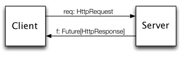

Twitter Scala School
================================================================================

## About and Approach

### About and Approach

**About**
Scala school started as a series of lectures at Twitter to prepare experienced engineers to be productive [Scala](http://www.scala-lang.org/) programmers. Scala is a relatively new language, but draws on many familiar concepts. Thus, these lectures assumed the audience knew the concepts and showed how to use them in Scala. We found this an effective way of getting new engineers up to speed quickly. This is the written material that accompanied those lectures. We have found that these are useful in their own right.

**Approach**
We think it makes the most sense to approach teaching Scala not as if it were an improved Java but instead as a new language. Experience in Java is not expected. Focus will be on the interpreter and the object-functional style as well as the style of programming we do here. An emphasis will be placed on maintainability, clarity of expression, and leveraging the type system.

Most of the lessons require no software other than a Scala REPL. The reader is encouraged to follow along, but also to go further! Use these lessons as a starting point to explore the language.

**Also**
You can learn more elsewhere:

- **[Effective Scala](http://twitter.github.com/effectivescala/)** Twitter's "best practices" for Scala. Useful for understanding idioms in Twitter's code.
- **[scala-lang.org Documentation](http://docs.scala-lang.org)** Links to tutorials, manuals, API reference, books, ...
- **[Scala API Documentation](http://www.scala-lang.org/api/)**

********************************************************************************

## Basics

### Basics

- About this class
- expressions
- values
- functions
- classes
- basic inheritance
- traits
- types

**About this class**
The first few weeks will cover basic syntax and concepts, then we’ll start to open it up with more exercises.

Some examples will be given as if written in the interpreter and others as if written in a source file.

Having an interpreter available makes it easy to explore a problem space.

**Why Scala?**
- Expressive 
  - First-class functions
  - Closures

- Concise 
  - Type inference
  - Literal syntax for function creation

- Java interoperability 
  - Can reuse java libraries
  - Can reuse java tools
  - No performance penalty

**How Scala?**
- Compiles to java bytecode
- Works with any standard JVM
  - Or even some non-standard JVMs like Dalvik
  - Scala compiler written by author of Java compiler

**Think Scala**
Scala is not just a nicer Java. You should learn it with a fresh mind- you will get more out of these classes.

**Get Scala**
Scala School’s examples work with [Scala 2.9.x](http://www.scala-lang.org/download/2.9.3.html) . If you use Scala 2.10.x or newer, _most_ examples work OK, but not all.

**Start the Interpreter**
Start the included `sbt console`.

    $ sbt console
    
    
    [...]
    
    
    Welcome to Scala version 2.8.0.final (Java HotSpot(TM) 64-Bit Server VM, Java 1.6.0_20).
    Type in expressions to have them evaluated.
    Type :help for more information.
    
    
    scala>

**Expressions**
    scala> 1 + 1
    res0: Int = 2

res0 is an automatically created value name given by the interpreter to the result of your expression. It has the type Int and contains the Integer 2.

(Almost) everything in Scala is an expression.

**Values**
You can give the result of an expression a name.

    scala> val two = 1 + 1
    two: Int = 2

You cannot change the binding to a val.

**Variables**
If you need to change the binding, you can use a `var` instead.

    scala> var name = "steve"
    name: java.lang.String = steve
    
    
    scala> name = "marius"
    name: java.lang.String = marius

**Functions**
You can create functions with def.

    scala> def addOne(m: Int): Int = m + 1
    addOne: (m: Int)Int

In Scala, you need to specify the type signature for function parameters. The interpreter happily repeats the type signature back to you.

    scala> val three = addOne(2)
    three: Int = 3

You can leave off parens on functions with no arguments.

    scala> def three() = 1 + 2
    three: ()Int
    
    
    scala> three()
    res2: Int = 3
    
    
    scala> three
    res3: Int = 3

**Anonymous Functions**
You can create anonymous functions.

    scala> (x: Int) => x + 1
    res2: (Int) => Int = <function1>

This function adds 1 to an Int named x.

    scala> res2(1)
    res3: Int = 2

You can pass anonymous functions around or save them into vals.

    scala> val addOne = (x: Int) => x + 1
    addOne: (Int) => Int = <function1>
    
    
    scala> addOne(1)
    res4: Int = 2

If your function is made up of many expressions, you can use {} to give yourself some breathing room.

    def timesTwo(i: Int): Int = {
      println("hello world")
      i * 2
    }

This is also true of an anonymous function.

    scala> { i: Int =>
      println("hello world")
      i * 2
    }
    res0: (Int) => Int = <function1>

You will see this syntax often used when passing an anonymous function as an argument.

**Partial application**
You can partially apply a function with an underscore, which gives you another function. Scala uses the underscore to mean different things in different contexts, but you can usually think of it as an unnamed magical wildcard. In the context of `{ _ + 2 }` it means an unnamed parameter. You can use it like so:

    scala> def adder(m: Int, n: Int) = m + n
    adder: (m: Int,n: Int)Int

    scala> val add2 = adder(2, _:Int)
    add2: (Int) => Int = <function1>
    
    
    scala> add2(3)
    res50: Int = 5

You can partially apply any argument in the argument list, not just the last one.

**Curried functions**
Sometimes it makes sense to let people apply some arguments to your function now and others later.

Here’s an example of a function that lets you build multipliers of two numbers together. At one call site, you’ll decide which is the multiplier and at a later call site, you’ll choose a multiplicand.

    scala> def multiply(m: Int)(n: Int): Int = m * n
    multiply: (m: Int)(n: Int)Int

You can call it directly with both arguments.

    scala> multiply(2)(3)
    res0: Int = 6

You can fill in the first parameter and partially apply the second.

    scala> val timesTwo = multiply(2) _
    timesTwo: (Int) => Int = <function1>
    
    
    scala> timesTwo(3)
    res1: Int = 6

You can take any function of multiple arguments and curry it. Let’s try with our earlier `adder`

    scala> val curriedAdd = (adder _).curried
    curriedAdd: Int => (Int => Int) = <function1>
    
    
    scala> val addTwo = curriedAdd(2)
    addTwo: Int => Int = <function1>
    
    
    scala> addTwo(4)
    res22: Int = 6

**Variable length arguments**
There is a special syntax for methods that can take parameters of a repeated type. To apply String’s `capitalize` function to several strings, you might write:

    def capitalizeAll(args: String*) = {
      args.map { arg =>
        arg.capitalize
      }
    }
    
    
    scala> capitalizeAll("rarity", "applejack")
    res2: Seq[String] = ArrayBuffer(Rarity, Applejack)

**Classes**
    scala> class Calculator {
         | val brand: String = "HP"
         | def add(m: Int, n: Int): Int = m + n
         | }
    defined class Calculator
    
    
    scala> val calc = new Calculator
    calc: Calculator = Calculator@e75a11
    
    
    scala> calc.add(1, 2)
    res1: Int = 3
    
    
    scala> calc.brand
    res2: String = "HP"

Contained are examples defining methods with def and fields with val. Methods are just functions that can access the state of the class.

**Constructor**
Constructors aren’t special methods, they are the code outside of method definitions in your class. Let’s extend our Calculator example to take a constructor argument and use it to initialize internal state.

    class Calculator(brand: String) {
      /**
       * A constructor.
       */
      val color: String = if (brand == "TI") {
        "blue"
      } else if (brand == "HP") {
        "black"
      } else {
        "white"
      }
    
    
      // An instance method.
      def add(m: Int, n: Int): Int = m + n
    }

Note the two different styles of comments.

You can use the constructor to construct an instance:

    scala> val calc = new Calculator("HP")
    calc: Calculator = Calculator@1e64cc4d
    
    
    scala> calc.color
    res0: String = black

**Expressions**
Our Calculator example gave an example of how Scala is expression-oriented. The value color was bound based on an if/else expression. Scala is highly expression-oriented: most things are expressions rather than statements.

**Aside: Functions vs Methods**
Functions and methods are largely interchangeable. Because functions and methods are so similar, you might not remember whether that _thing_ you call is a function or a method. When you bump into a difference between methods and functions, it might confuse you.

    scala> class C {
         | var acc = 0
         | def minc = { acc += 1 }
         | val finc = { () => acc += 1 }
         | }
    defined class C
    
    
    scala> val c = new C
    c: C = C@1af1bd6
    
    
    scala> c.minc // calls c.minc()
    
    
    scala> c.finc // returns the function as a value:
    res2: () => Unit = <function0>

When you can call one “function” without parentheses but not another, you might think _Whoops, I thought I knew how Scala functions worked, but I guess not. Maybe they sometimes need parentheses?_ You might understand functions, but be using a method.

In practice, you can do great things in Scala while remaining hazy on the difference between methods and functions. If you’re new to Scala and read [explanations of the differences](https://www.google.com/search?q=difference+scala+function+method), you might have trouble following them. That doesn’t mean you’re going to have trouble using Scala. It just means that the difference between functions and methods is subtle enough such that explanations tend to dig into deep parts of the language.

**Inheritance**
    class ScientificCalculator(brand: String) extends Calculator(brand) {
      def log(m: Double, base: Double) = math.log(m) / math.log(base)
    }

**See Also** Effective Scala points out that a [Type alias](http://twitter.github.com/effectivescala/#Types%20and%20Generics-Type%20aliases) is better than `extends` if the subclass isn’t actually different from the superclass. A Tour of Scala describes [Subclassing](http://www.scala-lang.org/node/125).

**Overloading methods**
    class EvenMoreScientificCalculator(brand: String) extends ScientificCalculator(brand) {
      def log(m: Int): Double = log(m, math.exp(1))
    }

**Abstract Classes**
You can define an _abstract class_, a class that defines some methods but does not implement them. Instead, subclasses that extend the abstract class define these methods. You can’t create an instance of an abstract class.

    scala> abstract class Shape {
         | def getArea():Int // subclass should define this
         | }
    defined class Shape
    
    
    scala> class Circle(r: Int) extends Shape {
         | def getArea():Int = { r * r * 3 }
         | }
    defined class Circle
    
    
    scala> val s = new Shape
    <console>:8: error: class Shape is abstract; cannot be instantiated
           val s = new Shape
                   ^
    
    
    scala> val c = new Circle(2)
    c: Circle = Circle@65c0035b

**Traits**
`traits` are collections of fields and behaviors that you can extend or mixin to your classes.

    trait Car {
      val brand: String
    }
    
    
    trait Shiny {
      val shineRefraction: Int
    }

    class BMW extends Car {
      val brand = "BMW"
    }

One class can extend several traits using the `with` keyword:

    class BMW extends Car with Shiny {
      val brand = "BMW"
      val shineRefraction = 12
    }

**See Also** Effective Scala has opinions about [trait](http://twitter.github.com/effectivescala/#Object oriented programming-Traits).

**When do you want a Trait instead of an Abstract Class?** If you want to define an interface-like type, you might find it difficult to choose between a trait or an abstract class. Either one lets you define a type with some behavior, asking extenders to define some other behavior. Some rules of thumb:

- Favor using traits. It’s handy that a class can extend several traits; a class can extend only one class.  

- If you need a constructor parameter, use an abstract class. Abstract class constructors can take parameters; trait constructors can’t. For example, you can’t say `trait t(i: Int) {}`; the `i` parameter is illegal.

You are not the first person to ask this question. See fuller answers at [stackoverflow:Scala traits vs abstract classes](http://stackoverflow.com/questions/1991042/scala-traits-vs-abstract-classes), [Difference between Abstract Class and Trait](http://stackoverflow.com/questions/2005681/difference-between-abstract-class-and-trait), and [Programming in Scala: To trait, or not to trait?](http://www.artima.com/pins1ed/traits.html#12.7)

**Types**
Earlier, you saw that we defined a function that took an `Int` which is a type of Number. Functions can also be generic and work on any type. When that occurs, you’ll see a type parameter introduced with the square bracket syntax. Here’s an example of a Cache of generic Keys and Values.

    trait Cache[K, V] {
      def get(key: K): V
      def put(key: K, value: V)
      def delete(key: K)
    }

Methods can also have type parameters introduced.

    def remove[K](key: K)

********************************************************************************

## Basics continued

### Basics continued

This lesson covers:

- apply
- objects
- Functions are Objects
- packages
- pattern matching
- case classes
- try-catch-finally

**apply methods**
apply methods give you a nice syntactic sugar for when a class or object has one main use.

    scala> class Foo {}
    defined class Foo
    
    
    scala> object FooMaker {
         | def apply() = new Foo
         | }
    defined module FooMaker
    
    
    scala> val newFoo = FooMaker()
    newFoo: Foo = Foo@5b83f762

or

    scala> class Bar {
         | def apply() = 0
         | }
    defined class Bar
    
    
    scala> val bar = new Bar
    bar: Bar = Bar@47711479
    
    
    scala> bar()
    res8: Int = 0

Here our instance object looks like we’re calling a method. More on that later!

**Objects**
Objects are used to hold single instances of a class. Often used for factories.

    object Timer {
      var count = 0
    
    
      def currentCount(): Long = {
        count += 1
        count
      }
    }

How to use

    scala> Timer.currentCount()
    res0: Long = 1

Classes and Objects can have the same name. The object is called a ‘Companion Object’. We commonly use Companion Objects for Factories.

Here is a trivial example that only serves to remove the need to use ‘new’ to create an instance.

    class Bar(foo: String)
    
    
    object Bar {
      def apply(foo: String) = new Bar(foo)
    }

**Functions are Objects**
In Scala, we talk about object-functional programming often. What does that mean? What is a Function, really?

A Function is a set of traits. Specifically, a function that takes one argument is an instance of a Function1 trait. This trait defines the `apply()` syntactic sugar we learned earlier, allowing you to call an object like you would a function.

    scala> object addOne extends Function1[Int, Int] {
         | def apply(m: Int): Int = m + 1
         | }
    defined module addOne
    
    
    scala> addOne(1)
    res2: Int = 2

There is Function0 through 22. Why 22? It’s an arbitrary magic number. I’ve never needed a function with more than 22 arguments so it seems to work out.

The syntactic sugar of apply helps unify the duality of object and functional programming. You can pass classes around and use them as functions and functions are just instances of classes under the covers.

Does this mean that every time you define a method in your class, you’re actually getting an instance of Function\*? No, methods in classes are methods. Methods defined standalone in the repl are Function\* instances.

Classes can also extend Function and those instances can be called with ().

    scala> class AddOne extends Function1[Int, Int] {
         | def apply(m: Int): Int = m + 1
         | }
    defined class AddOne
    
    
    scala> val plusOne = new AddOne()
    plusOne: AddOne = <function1>
    
    
    scala> plusOne(1)
    res0: Int = 2

A nice short-hand for `extends Function1[Int, Int]` is `extends (Int => Int)`

    class AddOne extends (Int => Int) {
      def apply(m: Int): Int = m + 1
    }

**Packages**
You can organize your code inside of packages.

    package com.twitter.example

at the top of a file will declare everything in the file to be in that package.

Values and functions cannot be outside of a class or object. Objects are a useful tool for organizing static functions.

    package com.twitter.example
    
    
    object colorHolder {
      val BLUE = "Blue"
      val RED = "Red"
    }

Now you can access the members directly

    println("the color is: " + com.twitter.example.colorHolder.BLUE)

Notice what the scala repl says when you define this object:

    scala> object colorHolder {
         | val Blue = "Blue"
         | val Red = "Red"
         | }
    defined module colorHolder

This gives you a small hint that the designers of Scala designed objects to be part of Scala’s module system.

**Pattern Matching**
One of the most useful parts of Scala.

Matching on values

    val times = 1
    
    
    times match {
      case 1 => "one"
      case 2 => "two"
      case _ => "some other number"
    }

Matching with guards

    times match {
      case i if i == 1 => "one"
      case i if i == 2 => "two"
      case _ => "some other number"
    }

Notice how we captured the value in the variable ‘i’.

The `_` in the last case statement is a wildcard; it ensures that we can handle any statement. Otherwise you will suffer a runtime error if you pass in a number that doesn’t match. We discuss this more later.

**See Also** Effective Scala has opinions about [when to use pattern matching](http://twitter.github.com/effectivescala/#Functional programming-Pattern matching) and [pattern matching formatting](http://twitter.github.com/effectivescala/#Formatting-Pattern matching). A Tour of Scala describes [Pattern Matching](http://www.scala-lang.org/node/120)

**Matching on type**
You can use `match` to handle values of different types differently.

    def bigger(o: Any): Any = {
      o match {
        case i: Int if i < 0 => i - 1
        case i: Int => i + 1
        case d: Double if d < 0.0 => d - 0.1
        case d: Double => d + 0.1
        case text: String => text + "s"
      }
    }

**Matching on class members**
Remember our calculator from earlier.

Let’s classify them according to type.

Here’s the painful way first.

    def calcType(calc: Calculator) = calc match {
      case _ if calc.brand == "hp" && calc.model == "20B" => "financial"
      case _ if calc.brand == "hp" && calc.model == "48G" => "scientific"
      case _ if calc.brand == "hp" && calc.model == "30B" => "business"
      case _ => "unknown"
    }

Wow, that’s painful. Thankfully Scala provides some nice tools specifically for this.

**Case Classes**
case classes are used to conveniently store and match on the contents of a class. You can construct them without using new.

    scala> case class Calculator(brand: String, model: String)
    defined class Calculator
    
    
    scala> val hp20b = Calculator("hp", "20b")
    hp20b: Calculator = Calculator(hp,20b)

case classes automatically have equality and nice toString methods based on the constructor arguments.

    scala> val hp20b = Calculator("hp", "20b")
    hp20b: Calculator = Calculator(hp,20b)
    
    
    scala> val hp20B = Calculator("hp", "20b")
    hp20B: Calculator = Calculator(hp,20b)
    
    
    scala> hp20b == hp20B
    res6: Boolean = true

case classes can have methods just like normal classes.

**Case Classes with pattern matching**
case classes are designed to be used with pattern matching. Let’s simplify our calculator classifier example from earlier.

    val hp20b = Calculator("hp", "20B")
    val hp30b = Calculator("hp", "30B")
    
    
    def calcType(calc: Calculator) = calc match {
      case Calculator("hp", "20B") => "financial"
      case Calculator("hp", "48G") => "scientific"
      case Calculator("hp", "30B") => "business"
      case Calculator(ourBrand, ourModel) => "Calculator: %s %s is of unknown type".format(ourBrand, ourModel)
    }

Other alternatives for that last match

    case Calculator(_, _) => "Calculator of unknown type"

OR we could simply not specify that it’s a Calculator at all.

    case _ => "Calculator of unknown type"

OR we could re-bind the matched value with another name

    case c@Calculator(_, _) => "Calculator: %s of unknown type".format(c)

**Exceptions**
Exceptions are available in Scala via a try-catch-finally syntax that uses pattern matching.

    try {
      remoteCalculatorService.add(1, 2)
    } catch {
      case e: ServerIsDownException => log.error(e, "the remote calculator service is unavailable. should have kept your trusty HP.")
    } finally {
      remoteCalculatorService.close()
    }

`try`s are also expression-oriented

    val result: Int = try {
      remoteCalculatorService.add(1, 2)
    } catch {
      case e: ServerIsDownException => {
        log.error(e, "the remote calculator service is unavailable. should have kept your trusty HP.")
        0
      }
    } finally {
      remoteCalculatorService.close()
    }

This is not an example of excellent programming style, just an example of try-catch-finally resulting in expressions like most everything else in Scala.

Finally will be called after an exception has been handled and is not part of the expression.

********************************************************************************

## Collections

### Collections

This lesson covers:

- Basic Data Structures 
  - Lists
  - Sets
  - Tuple
  - Maps
  - Option

- Functional Combinators 
  - map
  - foreach
  - filter
  - zip
  - partition
  - find
  - drop and dropWhile
  - foldRight and foldLeft
  - flatten
  - flatMap
  - Generalized functional combinators
  - Map?

# Basic Data Structures

Scala provides some nice collections.

**See Also** Effective Scala has opinions about how to use [collections](http://twitter.github.com/effectivescala/#Collections).

**Lists**
    scala> val numbers = List(1, 2, 3, 4)
    numbers: List[Int] = List(1, 2, 3, 4)

**Sets**
Sets have no duplicates

    scala> Set(1, 1, 2)
    res0: scala.collection.immutable.Set[Int] = Set(1, 2)

**Tuple**
A tuple groups together simple logical collections of items without using a class.

    scala> val hostPort = ("localhost", 80)
    hostPort: (String, Int) = (localhost, 80)

Unlike case classes, they don’t have named accessors, instead they have accessors that are named by their position and is 1-based rather than 0-based.

    scala> hostPort._1
    res0: String = localhost
    
    
    scala> hostPort._2
    res1: Int = 80

Tuples fit with pattern matching nicely.

    hostPort match {
      case ("localhost", port) => ...
      case (host, port) => ...
    }

Tuple has some special sauce for simply making Tuples of 2 values: `->`

    scala> 1 -> 2
    res0: (Int, Int) = (1,2)

**See Also** Effective Scala has opinions about [destructuring bindings](http://twitter.github.com/effectivescala/#Functional programming-Destructuring bindings) (“unpacking” a tuple).

**Maps**
It can hold basic datatypes.

    Map(1 -> 2)
    Map("foo" -> "bar")

This looks like special syntax but remember back to our discussion of Tuple that `->` can be use to create Tuples.

Map() also uses that variable argument syntax we learned back in Lesson #1: `Map(1 -> "one", 2 -> "two")` which expands into `Map((1, "one"), (2, "two"))` with the first element being the key and the second being the value of the Map.

Maps can themselves contain Maps or even functions as values.

    Map(1 -> Map("foo" -> "bar"))

    Map("timesTwo" -> { timesTwo(_) })

**Option**
`Option` is a container that may or may not hold something.

The basic interface for Option looks like:

    trait Option[T] {
      def isDefined: Boolean
      def get: T
      def getOrElse(t: T): T
    }

Option itself is generic and has two subclasses: `Some[T]` or `None`

Let’s look at an example of how Option is used:

`Map.get` uses `Option` for its return type. Option tells you that the method might not return what you’re asking for.

    scala> val numbers = Map(1 -> "one", 2 -> "two")
    numbers: scala.collection.immutable.Map[Int,String] = Map((1,one), (2,two))
    
    
    scala> numbers.get(2)
    res0: Option[java.lang.String] = Some(two)
    
    
    scala> numbers.get(3)
    res1: Option[java.lang.String] = None

Now our data appears trapped in this `Option`. How do we work with it?

A first instinct might be to do something conditionally based on the `isDefined` method.

    // We want to multiply the number by two, otherwise return 0.
    val result = if (res1.isDefined) {
      res1.get * 2
    } else {
      0
    }

We would suggest that you use either `getOrElse` or pattern matching to work with this result.

`getOrElse` lets you easily define a default value.

    val result = res1.getOrElse(0) * 2

Pattern matching fits naturally with `Option`.

    val result = res1 match {
      case Some(n) => n * 2
      case None => 0
    }

**See Also** Effective Scala has opinions about [Options](http://twitter.github.com/effectivescala/#Functional programming-Options).

# Functional Combinators

`List(1, 2, 3) map squared` applies the function `squared` to the elements of the list, returning a new list, perhaps `List(1, 4, 9)`. We call operations like `map` _combinators_. (If you’d like a better definition, you might like [Explanation of combinators](http://stackoverflow.com/questions/7533837/explanation-of-combinators-for-the-working-man) on Stackoverflow.) Their most common use is on the standard data structures.

**map**
Evaluates a function over each element in the list, returning a list with the same number of elements.

    scala> numbers.map((i: Int) => i * 2)
    res0: List[Int] = List(2, 4, 6, 8)

or pass in a partially evaluated function

    scala> def timesTwo(i: Int): Int = i * 2
    timesTwo: (i: Int)Int
    
    
    scala> numbers.map(timesTwo _)
    res0: List[Int] = List(2, 4, 6, 8)

**foreach**
foreach is like map but returns nothing. foreach is intended for side-effects only.

    scala> numbers.foreach((i: Int) => i * 2)

returns nothing.

You can try to store the return in a value but it’ll be of type Unit (i.e. void)

    scala> val doubled = numbers.foreach((i: Int) => i * 2)
    doubled: Unit = ()

**filter**
removes any elements where the function you pass in evaluates to false. Functions that return a Boolean are often called predicate functions.

    scala> numbers.filter((i: Int) => i % 2 == 0)
    res0: List[Int] = List(2, 4)

    scala> def isEven(i: Int): Boolean = i % 2 == 0
    isEven: (i: Int)Boolean
    
    
    scala> numbers.filter(isEven _)
    res2: List[Int] = List(2, 4)

**zip**
zip aggregates the contents of two lists into a single list of pairs.

    scala> List(1, 2, 3).zip(List("a", "b", "c"))
    res0: List[(Int, String)] = List((1,a), (2,b), (3,c))

**partition**
`partition` splits a list based on where it falls with respect to a predicate function.

    scala> val numbers = List(1, 2, 3, 4, 5, 6, 7, 8, 9, 10)
    scala> numbers.partition(_ % 2 == 0)
    res0: (List[Int], List[Int]) = (List(2, 4, 6, 8, 10),List(1, 3, 5, 7, 9))

**find**
find returns the first element of a collection that matches a predicate function.

    scala> numbers.find((i: Int) => i > 5)
    res0: Option[Int] = Some(6)

**drop & dropWhile**
`drop` drops the first i elements

    scala> numbers.drop(5)
    res0: List[Int] = List(6, 7, 8, 9, 10)

`dropWhile` removes the first elements that match a predicate function. For example, if we `dropWhile` odd numbers from our list of numbers, `1` gets dropped (but not `3` which is “shielded” by `2`).

    scala> numbers.dropWhile(_ % 2 != 0)
    res0: List[Int] = List(2, 3, 4, 5, 6, 7, 8, 9, 10)

**foldLeft**
    scala> numbers.foldLeft(0)((m: Int, n: Int) => m + n)
    res0: Int = 55

0 is the starting value (Remember that numbers is a List[Int]), and m  
acts as an accumulator.

Seen visually:

    scala> numbers.foldLeft(0) { (m: Int, n: Int) => println("m: " + m + " n: " + n); m + n }
    m: 0 n: 1
    m: 1 n: 2
    m: 3 n: 3
    m: 6 n: 4
    m: 10 n: 5
    m: 15 n: 6
    m: 21 n: 7
    m: 28 n: 8
    m: 36 n: 9
    m: 45 n: 10
    res0: Int = 55

**foldRight**
Is the same as foldLeft except it runs in the opposite direction.

    scala> numbers.foldRight(0) { (m: Int, n: Int) => println("m: " + m + " n: " + n); m + n }
    m: 10 n: 0
    m: 9 n: 10
    m: 8 n: 19
    m: 7 n: 27
    m: 6 n: 34
    m: 5 n: 40
    m: 4 n: 45
    m: 3 n: 49
    m: 2 n: 52
    m: 1 n: 54
    res0: Int = 55

**flatten**
flatten collapses one level of nested structure.

    scala> List(List(1, 2), List(3, 4)).flatten
    res0: List[Int] = List(1, 2, 3, 4)

**flatMap**
flatMap is a frequently used combinator that combines mapping and flattening. flatMap takes a function that works on the nested lists and then concatenates the results back together.

    scala> val nestedNumbers = List(List(1, 2), List(3, 4))
    nestedNumbers: List[List[Int]] = List(List(1, 2), List(3, 4))
    
    
    scala> nestedNumbers.flatMap(x => x.map(_ * 2))
    res0: List[Int] = List(2, 4, 6, 8)

Think of it as short-hand for mapping and then flattening:

    scala> nestedNumbers.map((x: List[Int]) => x.map(_ * 2)).flatten
    res1: List[Int] = List(2, 4, 6, 8)

that example calling map and then flatten is an example of the “combinator”-like nature of these functions.

**See Also** Effective Scala has opinions about [flatMap](http://twitter.github.com/effectivescala/#Functional programming-`flatMap`).

**Generalized functional combinators**
Now we’ve learned a grab-bag of functions for working with collections.

What we’d like is to be able to write our own functional combinators.

Interestingly, every functional combinator shown above can be written on top of fold. Let’s see some examples.

    def ourMap(numbers: List[Int], fn: Int => Int): List[Int] = {
      numbers.foldRight(List[Int]()) { (x: Int, xs: List[Int]) =>
        fn(x) :: xs
      }
    }
    
    
    scala> ourMap(numbers, timesTwo(_))
    res0: List[Int] = List(2, 4, 6, 8, 10, 12, 14, 16, 18, 20)

Why <tt>List[Int]()</tt>? Scala wasn’t smart enough to realize that you wanted an empty list of Ints to accumulate into.

**Map?**
All of the functional combinators shown work on Maps, too. Maps can be thought of as a list of pairs so the functions you write work on a pair of the keys and values in the Map.

    scala> val extensions = Map("steve" -> 100, "bob" -> 101, "joe" -> 201)
    extensions: scala.collection.immutable.Map[String,Int] = Map((steve,100), (bob,101), (joe,201))

Now filter out every entry whose phone extension is lower than 200.

    scala> extensions.filter((namePhone: (String, Int)) => namePhone._2 < 200)
    res0: scala.collection.immutable.Map[String,Int] = Map((steve,100), (bob,101))

Because it gives you a tuple, you have to pull out the keys and values with their positional accessors. Yuck!

Lucky us, we can actually use a pattern match to extract the key and value nicely.

    scala> extensions.filter({case (name, extension) => extension < 200})
    res0: scala.collection.immutable.Map[String,Int] = Map((steve,100), (bob,101))

Why does this work? Why can you pass in a partial pattern match?

Stay tuned for next week!

********************************************************************************

## Pattern matching & functional composition

### Pattern matching & functional composition

This lesson covers:

- Function Composition
  - compose
  - andThen

- Currying vs Partial Application
- PartialFunctions
  - range and domain
  - composition with orElse

- What is a case statement?

**Function Composition**
Let’s make two aptly-named functions:

    scala> def f(s: String) = "f(" + s + ")"
    f: (String)java.lang.String
    
    
    scala> def g(s: String) = "g(" + s + ")"
    g: (String)java.lang.String

**compose**
`compose` makes a new function that composes other functions `f(g(x))`

    scala> val fComposeG = f _ compose g _
    fComposeG: (String) => java.lang.String = <function>
    
    
    scala> fComposeG("yay")
    res0: java.lang.String = f(g(yay))

**andThen**
`andThen` is like `compose`, but calls the first function and then the second, `g(f(x))`

    scala> val fAndThenG = f _ andThen g _
    fAndThenG: (String) => java.lang.String = <function>
    
    
    scala> fAndThenG("yay")
    res1: java.lang.String = g(f(yay))

**Currying vs Partial Application**
**case statements**
**So just what are case statements?**
It’s a subclass of function called a PartialFunction.

**What is a collection of multiple case statements?**
They are multiple PartialFunctions composed together.

**Understanding PartialFunction**
A function works for every argument of the defined type. In other words, a function defined as (Int) => String takes any Int and returns a String.

A Partial Function is only defined for certain values of the defined type. A Partial Function (Int) => String might not accept every Int.

`isDefinedAt` is a method on PartialFunction that can be used to determine if the PartialFunction will accept a given argument.

_Note_ `PartialFunction` is unrelated to a partially applied function that we talked about earlier.

**See Also** Effective Scala has opinions about [PartialFunction](http://twitter.github.com/effectivescala/#Functional programming-Partial functions).

    scala> val one: PartialFunction[Int, String] = { case 1 => "one" }
    one: PartialFunction[Int,String] = <function1>
    
    
    scala> one.isDefinedAt(1)
    res0: Boolean = true
    
    
    scala> one.isDefinedAt(2)
    res1: Boolean = false

You can apply a partial function.

    scala> one(1)
    res2: String = one

PartialFunctions can be composed with something new, called orElse, that reflects whether the PartialFunction is defined over the supplied argument.

    scala> val two: PartialFunction[Int, String] = { case 2 => "two" }
    two: PartialFunction[Int,String] = <function1>
    
    
    scala> val three: PartialFunction[Int, String] = { case 3 => "three" }
    three: PartialFunction[Int,String] = <function1>
    
    
    scala> val wildcard: PartialFunction[Int, String] = { case _ => "something else" }
    wildcard: PartialFunction[Int,String] = <function1>
    
    
    scala> val partial = one orElse two orElse three orElse wildcard
    partial: PartialFunction[Int,String] = <function1>
    
    
    scala> partial(5)
    res24: String = something else
    
    
    scala> partial(3)
    res25: String = three
    
    
    scala> partial(2)
    res26: String = two
    
    
    scala> partial(1)
    res27: String = one
    
    
    scala> partial(0)
    res28: String = something else

**The mystery of case.**
Last week we saw something curious. We saw a case statement used where a function is normally used.

    scala> case class PhoneExt(name: String, ext: Int)
    defined class PhoneExt
    
    
    scala> val extensions = List(PhoneExt("steve", 100), PhoneExt("robey", 200))
    extensions: List[PhoneExt] = List(PhoneExt(steve,100), PhoneExt(robey,200))
    
    
    scala> extensions.filter { case PhoneExt(name, extension) => extension < 200 }
    res0: List[PhoneExt] = List(PhoneExt(steve,100))

Why does this work?

filter takes a function. In this case a predicate function of (PhoneExt) => Boolean.

A PartialFunction is a subtype of Function so filter can also take a PartialFunction!

********************************************************************************

## Type & polymorphism basics

### Type & polymorphism basics

This lesson covers:

- What are static types?
- Types in Scala
- Parametric Polymorphism
- Type inference: Hindley-Milner vs. local type inference
- Variance
- Bounds
- Quantification

**What are static types? Why are they useful?**
According to Pierce: “A type system is a syntactic method for automatically checking the absence of certain erroneous behaviors by classifying program phrases according to the kinds of values they compute.”

Types allow you to denote function domain & codomains. For example, from mathematics, we are used to seeing:

    f: R -> N

this tells us that function “f” maps values from the set of real numbers to values of the set of natural numbers.

In the abstract, this is exactly what _concrete_ types are. Type systems give us some more powerful ways to express these sets.

Given these annotations, the compiler can now _statically_ (at compile time) verify that the program is _sound_. That is, compilation will fail if values (at runtime) will not comply to the constraints imposed by the program.

Generally speaking, the typechecker can only guarantee that _unsound_ programs do not compile. It cannot guarantee that every sound program _will_ compile.

With increasing expressiveness in type systems, we can produce more reliable code because it allows us to prove invariants about our program before it even runs (modulo bugs in the types themselves, of course!). Academia is pushing the limits of expressiveness very hard, including value-dependent types!

Note that all type information is removed at compile time. It is no longer needed. This is called erasure.

**Types in Scala**
Scala’s powerful type system allows for very rich expression. Some of its chief features are:

- **parametric polymorphism** roughly, generic programming
- **(local) type inference** roughly, why you needn’t say `val i: Int = 12: Int`
- **existential quantification** roughly, defining something _for some_ unnamed type
- **views** we’ll learn these next week; roughly, “castability” of values of one type to another

**Parametric polymorphism**
Polymorphism is used in order to write generic code (for values of different types) without compromising static typing richness.

For example, without parametric polymorphism, a generic list data structure would always look like this (and indeed it did look like this in Java prior to generics):

    scala> 2 :: 1 :: "bar" :: "foo" :: Nil
    res5: List[Any] = List(2, 1, bar, foo)

Now we cannot recover any type information about the individual members.

    scala> res5.head
    res6: Any = 2

And so our application would devolve into a series of casts (“asInstanceOf[]”) and we would lack type safety (because these are all dynamic).

Polymorphism is achieved through specifying _type variables_.

    scala> def drop1[A](l: List[A]) = l.tail
    drop1: [A](l: List[A])List[A]
    
    
    scala> drop1(List(1,2,3))
    res1: List[Int] = List(2, 3)

**Scala has rank-1 polymorphism**
Roughly, this means that there are some type concepts you’d like to express in Scala that are “too generic” for the compiler to understand. Suppose you had some function

    def toList[A](a: A) = List(a)

which you wished to use generically:

    def foo[A, B](f: A => List[A], b: B) = f(b)

This does not compile, because all type variables have to be fixed at the invocation site. Even if you “nail down” type `B`,

    def foo[A](f: A => List[A], i: Int) = f(i)

…you get a type mismatch.

**Type inference**
A traditional objection to static typing is that it has much syntactic overhead. Scala alleviates this by providing _type inference_.

The classic method for type inference in functional programming languages is _Hindley-Milner_, and it was first employed in ML.

Scala’s type inference system works a little differently, but it’s similar in spirit: infer constraints, and attempt to unify a type.

In Scala, for example, you cannot do the following:

    scala> { x => x }
    <console>:7: error: missing parameter type
           { x => x }

Whereas in OCaml, you can:

    # fun x -> x;;
    - : 'a -> 'a = <fun>

In scala all type inference is _local_. Scala considers one expression at a time. For example:

    scala> def id[T](x: T) = x
    id: [T](x: T)T
    
    
    scala> val x = id(322)
    x: Int = 322
    
    
    scala> val x = id("hey")
    x: java.lang.String = hey
    
    
    scala> val x = id(Array(1,2,3,4))
    x: Array[Int] = Array(1, 2, 3, 4)

Types are now preserved, The Scala compiler infers the type parameter for us. Note also how we did not have to specify the return type explicitly.

**Variance**
Scala’s type system has to account for class hierarchies together with polymorphism. Class hierarchies allow the expression of subtype relationships. A central question that comes up when mixing OO with polymorphism is: if <tt>T’</tt> is a subclass of <tt>T</tt>, is <tt>Container[T’]</tt> considered a subclass of <tt>Container[T]</tt>? Variance annotations allow you to express the following relationships between class hierarchies & polymorphic types:

| | **Meaning** | **Scala notation** |
| **covariant** | C[T’] is a subclass of C[T] | [+T] |
| **contravariant** | C[T] is a subclass of C[T’] | [-T] |
| **invariant** | C[T] and C[T’] are not related | [T] |

The subtype relationship really means: for a given type T, if T’ is a subtype, can you substitute it?

    scala> class Covariant[+A]
    defined class Covariant
    
    
    scala> val cv: Covariant[AnyRef] = new Covariant[String]
    cv: Covariant[AnyRef] = Covariant@4035acf6
    
    
    scala> val cv: Covariant[String] = new Covariant[AnyRef]
    <console>:6: error: type mismatch;
     found : Covariant[AnyRef]
     required: Covariant[String]
           val cv: Covariant[String] = new Covariant[AnyRef]
                                       ^

    scala> class Contravariant[-A]
    defined class Contravariant
    
    
    scala> val cv: Contravariant[String] = new Contravariant[AnyRef]
    cv: Contravariant[AnyRef] = Contravariant@49fa7ba
    
    
    scala> val fail: Contravariant[AnyRef] = new Contravariant[String]
    <console>:6: error: type mismatch;
     found : Contravariant[String]
     required: Contravariant[AnyRef]
           val fail: Contravariant[AnyRef] = new Contravariant[String]
                                         ^

Contravariance seems strange. When is it used? Somewhat surprising!

    trait Function1 [-T1, +R] extends AnyRef

If you think about this from the point of view of substitution, it makes a lot of sense. Let’s first define a simple class hierarchy:

    scala> class Animal { val sound = "rustle" }
    defined class Animal
    
    
    scala> class Bird extends Animal { override val sound = "call" }
    defined class Bird
    
    
    scala> class Chicken extends Bird { override val sound = "cluck" }
    defined class Chicken

Suppose you need a function that takes a `Bird` param:

    scala> val getTweet: (Bird => String) = // TODO

The standard animal library has a function that does what you want, but it takes an `Animal` parameter instead. In most situations, if you say “I need a \_\_\_, I have a subclass of \_\_\_”, you’re OK. But function parameters are contravariant. If you need a function that takes a `Bird` and you have a function that takes an `Chicken`, that function would choke on a `Duck`. But a function that takes an `Animal` is OK:

    scala> val getTweet: (Bird => String) = ((a: Animal) => a.sound )
    getTweet: Bird => String = <function1>

A function’s return value type is covariant. If you need a function that returns a `Bird` but have a function that returns a `Chicken`, that’s great.

    scala> val hatch: (() => Bird) = (() => new Chicken )
    hatch: () => Bird = <function0>

**Bounds**
Scala allows you to restrict polymorphic variables using _bounds_. These bounds express subtype relationships.

    scala> def cacophony[T](things: Seq[T]) = things map (_.sound)
    <console>:7: error: value sound is not a member of type parameter T
           def cacophony[T](things: Seq[T]) = things map (_.sound)
                                                            ^
    
    
    scala> def biophony[T <: Animal](things: Seq[T]) = things map (_.sound)
    biophony: [T <: Animal](things: Seq[T])Seq[java.lang.String]
    
    
    scala> biophony(Seq(new Chicken, new Bird))
    res5: Seq[java.lang.String] = List(cluck, call)

Lower type bounds are also supported; they come in handy with contravariance and clever covariance. `List[+T]` is covariant; a list of Birds is a list of Animals. `List` defines an operator `::(elem T)` that returns a new `List` with `elem` prepended. The new `List` has the same type as the original:

    scala> val flock = List(new Bird, new Bird)
    flock: List[Bird] = List(Bird@7e1ec70e, Bird@169ea8d2)
    
    
    scala> new Chicken :: flock
    res53: List[Bird] = List(Chicken@56fbda05, Bird@7e1ec70e, Bird@169ea8d2)

`List` _also_ defines `::[B >: T](x: B)` which returns a `List[B]`. Notice the `B >: T`. That specifies type `B` as a superclass of `T`. That lets us do the right thing when prepending an `Animal` to a `List[Bird]`:

    scala> new Animal :: flock
    res59: List[Animal] = List(Animal@11f8d3a8, Bird@7e1ec70e, Bird@169ea8d2)

Note that the return type is `List[Animal]`.

**Quantification**
Sometimes you do not care to be able to name a type variable, for example:

    scala> def count[A](l: List[A]) = l.size
    count: [A](List[A])Int

Instead you can use “wildcards”:

    scala> def count(l: List[_]) = l.size
    count: (List[_])Int

This is shorthand for:

    scala> def count(l: List[T forSome { type T }]) = l.size
    count: (List[T forSome { type T }])Int

Note that quantification can get tricky:

    scala> def drop1(l: List[_]) = l.tail
    drop1: (List[_])List[Any]

Suddenly we lost type information! To see what’s going on, revert to the heavy-handed syntax:

    scala> def drop1(l: List[T forSome { type T }]) = l.tail
    drop1: (List[T forSome { type T }])List[T forSome { type T }]

We can’t say anything about T because the type does not allow it.

You may also apply bounds to wildcard type variables:

    scala> def hashcodes(l: Seq[_ <: AnyRef]) = l map (_.hashCode)
    hashcodes: (Seq[_ <: AnyRef])Seq[Int]
    
    
    scala> hashcodes(Seq(1,2,3))
    <console>:7: error: type mismatch;
     found : Int(1)
     required: AnyRef
    Note: primitive types are not implicitly converted to AnyRef.
    You can safely force boxing by casting x.asInstanceOf[AnyRef].
           hashcodes(Seq(1,2,3))
                         ^
    
    
    scala> hashcodes(Seq("one", "two", "three"))
    res1: Seq[Int] = List(110182, 115276, 110339486)

**See Also** [Existential types in Scala by D. R. MacIver](http://www.drmaciver.com/2008/03/existential-types-in-scala/)

********************************************************************************

## Advanced types

### Advanced types

This lesson covers:

- View bounds (“type classes”)
- Other Type Bounds
- Higher kinded types & ad-hoc polymorphism
- F-bounded polymorphism / recursive types
- Structural types
- Abstract types members
- Type erasures & manifests
- Case study: Finagle

**View bounds (“type classes”)**
Sometimes you don’t need to specify that one type is equal/sub/super another, just that you could fake it with conversions. A view bound specifies a type that can be “viewed as” another. This makes sense for an operation that needs to “read” an object but doesn’t modify the object.

**Implicit** functions allow automatic conversion. More precisely, they allow on-demand function application when this can help satisfy type inference. e.g.:

    scala> implicit def strToInt(x: String) = x.toInt
    strToInt: (x: String)Int
    
    
    scala> "123"
    res0: java.lang.String = 123
    
    
    scala> val y: Int = "123"
    y: Int = 123
    
    
    scala> math.max("123", 111)
    res1: Int = 123

View bounds, like type bounds demand such a function exists for the given type. You specify a view bound with `<%` e.g.,

    scala> class Container[A <% Int] { def addIt(x: A) = 123 + x }
    defined class Container

This says that **A** has to be “viewable” as **Int**. Let’s try it.

    scala> (new Container[String]).addIt("123")
    res11: Int = 246
    
    
    scala> (new Container[Int]).addIt(123) 
    res12: Int = 246
    
    
    scala> (new Container[Float]).addIt(123.2F)
    <console>:8: error: could not find implicit value for evidence parameter of type (Float) => Int
           (new Container[Float]).addIt(123.2)
            ^

**Other type bounds**
Methods can enforce more complex type bounds via implicit parameters. For example, `List` supports `sum` on numeric contents but not on others. Alas, Scala’s numeric types don’t all share a superclass, so we can’t just say `T <: Number`. Instead, to make this work, Scala’s math library [defines an implicit `Numeric[T]` for the appropriate types T](http://www.azavea.com/blogs/labs/2011/06/scalas-numeric-type-class-pt-1/). Then in `List`’s definition uses it:

    sum[B >: A](implicit num: Numeric[B]): B

If you invoke `List(1,2).sum()`, you don’t need to pass a _num_ parameter; it’s set implicitly. But if you invoke `List("whoop").sum()`, it complains that it couldn’t set `num`.

Methods may ask for some kinds of specific “evidence” for a type without setting up strange objects as with `Numeric`. Instead, you can use one of these type-relation operators:

| A =:= B | A must be equal to B |
| A <:< B | A must be a subtype of B |
| A <%< B | A must be viewable as B |

(If you get errors trying to use <:< or <%<, be aware that those went away in Scala 2.10. Scala School examples work with [Scala 2.9.x](http://www.scala-lang.org/download/2.9.3.html) . You can use a newer Scala, but expect errors.)

    scala> class Container[A](value: A) { def addIt(implicit evidence: A =:= Int) = 123 + value }
    defined class Container
    
    
    scala> (new Container(123)).addIt
    res11: Int = 246
    
    
    scala> (new Container("123")).addIt
    <console>:10: error: could not find implicit value for parameter evidence: =:=[java.lang.String,Int]

Similarly, given our previous implicit, we can relax the constraint to viewability:

    scala> class Container[A](value: A) { def addIt(implicit evidence: A <%< Int) = 123 + value }
    defined class Container
    
    
    scala> (new Container("123")).addIt
    res15: Int = 246

**Generic programming with views**
In the Scala standard library, views are primarily used to implement generic functions over collections. For example, the “min” function (on **Seq[]** ), uses this technique:

    def min[B >: A](implicit cmp: Ordering[B]): A = {
      if (isEmpty)
        throw new UnsupportedOperationException("empty.min")
    
    
      reduceLeft((x, y) => if (cmp.lteq(x, y)) x else y)
    }

The main advantages of this are:

- Items in the collections aren’t required to implement **Ordered** , but **Ordered** uses are still statically type checked.
- You can define your own orderings without any additional library support:

    scala> List(1,2,3,4).min
    res0: Int = 1
    
    
    scala> List(1,2,3,4).min(new Ordering[Int] { def compare(a: Int, b: Int) = b compare a })
    res3: Int = 4

As a sidenote, there are views in the standard library that translates **Ordered** into **Ordering** (and vice versa).

    trait LowPriorityOrderingImplicits {
      implicit def ordered[A <: Ordered[A]]: Ordering[A] = new Ordering[A] {
        def compare(x: A, y: A) = x.compare(y)
      }
    }

**Context bounds & implicitly[]**
Scala 2.8 introduced a shorthand for threading through & accessing implicit arguments.

    scala> def foo[A](implicit x: Ordered[A]) {}
    foo: [A](implicit x: Ordered[A])Unit
    
    
    scala> def foo[A : Ordered] {}                        
    foo: [A](implicit evidence$1: Ordered[A])Unit

Implicit values may be accessed via **implicitly**

    scala> implicitly[Ordering[Int]]
    res37: Ordering[Int] = scala.math.Ordering$Int$@3a9291cf

Combined, these often result in less code, especially when threading through views.

**Higher-kinded types & ad-hoc polymorphism**
Scala can abstract over “higher kinded” types. For example, suppose that you needed to use several types of containers for several types of data. You might define a `Container` interface that might be implemented by means of several container types: an `Option`, a `List`, etc. You want to define an interface for using values in these containers without nailing down the values’ type.

This is analogous to function currying. For example, whereas “unary types” have constructors like `List[A]`, meaning we have to satisfy one “level” of type variables in order to produce a concrete types (just like an uncurried function needs to be supplied by only one argument list to be invoked), a higher-kinded type needs more.

    scala> trait Container[M[_]] { def put[A](x: A): M[A]; def get[A](m: M[A]): A }
    
    
    scala> val container = new Container[List] { def put[A](x: A) = List(x); def get[A](m: List[A]) = m.head }
    container: java.lang.Object with Container[List] = $anon$1@7c8e3f75
    
    
    scala> container.put("hey")
    res24: List[java.lang.String] = List(hey)
    
    
    scala> container.put(123)
    res25: List[Int] = List(123)

Note that **Container** is polymorphic in a parameterized type (“container type”).

If we combine using containers with implicits, we get “ad-hoc” polymorphism: the ability to write generic functions over containers.

    scala> trait Container[M[_]] { def put[A](x: A): M[A]; def get[A](m: M[A]): A }
    
    
    scala> implicit val listContainer = new Container[List] { def put[A](x: A) = List(x); def get[A](m: List[A]) = m.head }
    
    
    scala> implicit val optionContainer = new Container[Some] { def put[A](x: A) = Some(x); def get[A](m: Some[A]) = m.get }
    
    
    scala> def tupleize[M[_]: Container, A, B](fst: M[A], snd: M[B]) = {
         | val c = implicitly[Container[M]]                             
         | c.put(c.get(fst), c.get(snd))
         | }
    tupleize: [M[_],A,B](fst: M[A],snd: M[B])(implicit evidence$1: Container[M])M[(A, B)]
    
    
    scala> tupleize(Some(1), Some(2))
    res33: Some[(Int, Int)] = Some((1,2))
    
    
    scala> tupleize(List(1), List(2))
    res34: List[(Int, Int)] = List((1,2))

**F-bounded polymorphism**
Often it’s necessary to access a concrete subclass in a (generic) trait. For example, imagine you had some trait that is generic, but can be compared to a particular subclass of that trait.

    trait Container extends Ordered[Container]

However, this now necessitates the compare method

    def compare(that: Container): Int

And so we cannot access the concrete subtype, e.g.:

    class MyContainer extends Container {
      def compare(that: MyContainer): Int
    }

fails to compile, since we are specifying Ordered for **Container** , not the particular subtype.

To reconcile this, we instead use F-bounded polymorphism.

    trait Container[A <: Container[A]] extends Ordered[A]

Strange type! But note now how Ordered is parameterized on **A** , which itself is **Container[A]**

So, now

    class MyContainer extends Container[MyContainer] { 
      def compare(that: MyContainer) = 0 
    }

They are now ordered:

    scala> List(new MyContainer, new MyContainer, new MyContainer)
    res3: List[MyContainer] = List(MyContainer@30f02a6d, MyContainer@67717334, MyContainer@49428ffa)
    
    
    scala> List(new MyContainer, new MyContainer, new MyContainer).min
    res4: MyContainer = MyContainer@33dfeb30

Given that they are all subtypes of **Container[\_]** , we can define another subclass & create a mixed list of **Container[\_]** :

    scala> class YourContainer extends Container[YourContainer] { def compare(that: YourContainer) = 0 }
    defined class YourContainer
    
    
    scala> List(new MyContainer, new MyContainer, new MyContainer, new YourContainer)                   
    res2: List[Container[_ >: YourContainer with MyContainer <: Container[_ >: YourContainer with MyContainer <: ScalaObject]]] 
      = List(MyContainer@3be5d207, MyContainer@6d3fe849, MyContainer@7eab48a7, YourContainer@1f2f0ce9)

Note how the resulting type is now lower-bound by **YourContainer with MyContainer**. This is the work of the type inferencer. Interestingly- this type doesn’t even need to make sense, it only provides a logical greatest lower bound for the unified type of the list. What happens if we try to use **Ordered** now?

    (new MyContainer, new MyContainer, new MyContainer, new YourContainer).min
    <console>:9: error: could not find implicit value for parameter cmp:
      Ordering[Container[_ >: YourContainer with MyContainer <: Container[_ >: YourContainer with MyContainer <: ScalaObject]]]

No **Ordered[]** exists for the unified type. Too bad.

**Structural types**
Scala has support for **structural types** — type requirements are expressed by interface _structure_ instead of a concrete type.

    scala> def foo(x: { def get: Int }) = 123 + x.get
    foo: (x: AnyRef{def get: Int})Int
    
    
    scala> foo(new { def get = 10 })                 
    res0: Int = 133

This can be quite nice in many situations, but the implementation uses reflection, so be performance-aware!

**Abstract type members**
In a trait, you can leave type members abstract.

    scala> trait Foo { type A; val x: A; def getX: A = x }
    defined trait Foo
    
    
    scala> (new Foo { type A = Int; val x = 123 }).getX   
    res3: Int = 123
    
    
    scala> (new Foo { type A = String; val x = "hey" }).getX
    res4: java.lang.String = hey

This is often a useful trick when doing dependency injection, etc.

You can refer to an abstract type variable using the hash-operator:

    scala> trait Foo[M[_]] { type t[A] = M[A] }
    defined trait Foo
    
    
    scala> val x: Foo[List]#t[Int] = List(1)
    x: List[Int] = List(1)

**Type erasures & manifests**
As we know, type information is lost at compile time due to _erasure_. Scala features **Manifests** , allowing us to selectively recover type information. Manifests are provided as an implicit value, generated by the compiler as needed.

    scala> class MakeFoo[A](implicit manifest: Manifest[A]) { def make: A = manifest.erasure.newInstance.asInstanceOf[A] }
    
    
    scala> (new MakeFoo[String]).make
    res10: String = ""

**Case study: Finagle**
See: [https://github.com/twitter/finagle](https://github.com/twitter/finagle)

    trait Service[-Req, +Rep] extends (Req => Future[Rep])
    
    
    trait Filter[-ReqIn, +RepOut, +ReqOut, -RepIn]
      extends ((ReqIn, Service[ReqOut, RepIn]) => Future[RepOut])
    {
      def andThen[Req2, Rep2](next: Filter[ReqOut, RepIn, Req2, Rep2]) =
        new Filter[ReqIn, RepOut, Req2, Rep2] {
          def apply(request: ReqIn, service: Service[Req2, Rep2]) = {
            Filter.this.apply(request, new Service[ReqOut, RepIn] {
              def apply(request: ReqOut): Future[RepIn] = next(request, service)
              override def release() = service.release()
              override def isAvailable = service.isAvailable
            })
          }
        }
        
        
      def andThen(service: Service[ReqOut, RepIn]) = new Service[ReqIn, RepOut] {
        private[this] val refcounted = new RefcountedService(service)
    
    
        def apply(request: ReqIn) = Filter.this.apply(request, refcounted)
        override def release() = refcounted.release()
        override def isAvailable = refcounted.isAvailable
      }    
    }

A service may authenticate requests with a filter.

    trait RequestWithCredentials extends Request {
      def credentials: Credentials
    }
    
    
    class CredentialsFilter(credentialsParser: CredentialsParser)
      extends Filter[Request, Response, RequestWithCredentials, Response]
    {
      def apply(request: Request, service: Service[RequestWithCredentials, Response]): Future[Response] = {
        val requestWithCredentials = new RequestWrapper with RequestWithCredentials {
          val underlying = request
          val credentials = credentialsParser(request) getOrElse NullCredentials
        }
    
    
        service(requestWithCredentials)
      }
    }

Note how the underlying service requires an authenticated request, and that this is statically verified. Filters can thus be thought of as service transformers.

Many filters can be composed together:

    val upFilter =
      logTransaction andThen
      handleExceptions andThen
      extractCredentials andThen
      homeUser andThen
      authenticate andThen
      route

Type safely!

********************************************************************************

## Simple Build Tool

### Simple Build Tool

This lesson covers SBT! Specific topics include:

- creating an sbt project
- basic commands
- the sbt console
- continuous command execution
- customizing your project
- custom commands
- quick tour of sbt source (if time)

**About SBT**
SBT is a modern build tool. While it is written in Scala and provides many Scala conveniences, it is a general purpose build tool.

**Why SBT?**
- Sane(ish) dependency management 
  - Ivy for dependency management
  - Only-update-on-request model

- Full Scala language support for creating tasks
- Continuous command execution
- Launch REPL in project context

**Getting Started**
- [Download the jar](http://www.scala-sbt.org/release/docs/Getting-Started/Setup.html)
- Create an sbt shell script that calls the jar, e.g.

    java -Xmx512M -jar sbt-launch.jar "$@"

- make sure it’s executable and in your path
- run sbt to create your project

    [local ~/projects]$ sbt
    Project does not exist, create new project? (y/N/s) y
    Name: sample
    Organization: com.twitter
    Version [1.0]: 1.0-SNAPSHOT
    Scala version [2.7.7]: 2.8.1
    sbt version [0.7.4]:      
    Getting Scala 2.7.7 ...
    :: retrieving :: org.scala-tools.sbt#boot-scala
    	confs: [default]
    	2 artifacts copied, 0 already retrieved (9911kB/221ms)
    Getting org.scala-tools.sbt sbt_2.7.7 0.7.4 ...
    :: retrieving :: org.scala-tools.sbt#boot-app
    	confs: [default]
    	15 artifacts copied, 0 already retrieved (4096kB/167ms)
    [success] Successfully initialized directory structure.
    Getting Scala 2.8.1 ...
    :: retrieving :: org.scala-tools.sbt#boot-scala
    	confs: [default]
    	2 artifacts copied, 0 already retrieved (15118kB/386ms)
    [info] Building project sample 1.0-SNAPSHOT against Scala 2.8.1
    [info] using sbt.DefaultProject with sbt 0.7.4 and Scala 2.7.7
    >

Note that it’s good form to start out with a SNAPSHOT version of your project.

**Project Layout**
- `project` – project definition files 
  - `project/build/` _yourproject_ `.scala` – the main project definition file
  - `project/build.properties` – project, sbt and scala version definitions

- `src/main` – your app code goes here, in a subdirectory indicating the  
code’s language (e.g. `src/main/scala`, `src/main/java`)
- `src/main/resources` – static files you want added to your jar  
 (e.g. logging config)
- `src/test` – like `src/main`, but for tests
- `lib_managed` – the jar files your project depends on. Populated by sbt update
- `target` – the destination for generated stuff (e.g. generated thrift  
 code, class files, jars)

**Adding Some Code**
We’ll be creating a simple JSON parser for simple tweets. Add the following code to  
`src/main/scala/com/twitter/sample/SimpleParser.scala`

    package com.twitter.sample
    
    
    case class SimpleParsed(id: Long, text: String)
    
    
    class SimpleParser {
    
    
      val tweetRegex = "\"id\":(.*),\"text\":\"(.*)\"".r
    
    
      def parse(str: String) = {
        tweetRegex.findFirstMatchIn(str) match {
          case Some(m) => {
            val id = str.substring(m.start(1), m.end(1)).toInt
            val text = str.substring(m.start(2), m.end(2))
            Some(SimpleParsed(id, text))
          }
          case _ => None
        }
      }
    }

This is ugly and buggy, but should compile.

**Testing in the Console**
SBT can be used both as a command line script and as a build console. We’ll be primarily using it as a build console, but most commands can be run standalone by passing the command as an argument to SBT, e.g.

    sbt test

Note that if a command takes arguments, you need to quote the entire  
argument path, e.g.

`sbt 'test-only com.twitter.sample.SampleSpec'`

It’s weird that way.

Anyway. To start working with our code, launch sbt

    [local ~/projects/sbt-sample]$ sbt
    [info] Building project sample 1.0-SNAPSHOT against Scala 2.8.1
    [info] using sbt.DefaultProject with sbt 0.7.4 and Scala 2.7.7
    >

SBT allows you to start a Scala REPL with all your project  
dependencies loaded. It compiles your project source before launching  
the console, providing us a quick way to bench test our parser.

    > console
    [info] 
    [info] == compile ==
    [info] Source analysis: 0 new/modified, 0 indirectly invalidated, 0 removed.
    [info] Compiling main sources...
    [info] Nothing to compile.
    [info] Post-analysis: 3 classes.
    [info] == compile ==
    [info] 
    [info] == copy-test-resources ==
    [info] == copy-test-resources ==
    [info] 
    [info] == test-compile ==
    [info] Source analysis: 0 new/modified, 0 indirectly invalidated, 0 removed.
    [info] Compiling test sources...
    [info] Nothing to compile.
    [info] Post-analysis: 0 classes.
    [info] == test-compile ==
    [info] 
    [info] == copy-resources ==
    [info] == copy-resources ==
    [info] 
    [info] == console ==
    [info] Starting scala interpreter...
    [info] 
    Welcome to Scala version 2.8.1.final (Java HotSpot(TM) 64-Bit Server VM, Java 1.6.0_22).
    Type in expressions to have them evaluated.
    Type :help for more information.
    
    
    scala>

Our code has compiled, and we’re provide the typical Scala prompt. We’ll create a new parser, an exemplar tweet, and ensure it “works”

    scala> import com.twitter.sample._            
    import com.twitter.sample._
    
    
    scala> val tweet = """{"id":1,"text":"foo"}"""
    tweet: java.lang.String = {"id":1,"text":"foo"}
    
    
    scala> val parser = new SimpleParser          
    parser: com.twitter.sample.SimpleParser = com.twitter.sample.SimpleParser@71060c3e
    
    
    scala> parser.parse(tweet)                    
    res0: Option[com.twitter.sample.SimpleParsed] = Some(SimpleParsed(1,"foo"}))
    
    
    scala>

**Adding Dependencies**
Our simple parser works for this very small set of inputs, but we want to add tests and break it. The first step is adding the specs test library and a real JSON parser to our project. To do this we have to go beyond the default SBT project layout and create a project.

SBT considers Scala files in the project/build directory to be project definitions. Add the following to project/build/SampleProject.scala

    import sbt._
    
    
    class SampleProject(info: ProjectInfo) extends DefaultProject(info) {
      val jackson = "org.codehaus.jackson" % "jackson-core-asl" % "1.6.1"
      val specs = "org.scala-tools.testing" % "specs_2.8.0" % "1.6.5" % "test"
    }

A project definition is an SBT class. In our case we extend SBT’s DefaultProject.

You declare dependencies by specifying a val that is a dependency. SBT uses reflection to scan all the dependency vals in your project and build up a dependency tree at build time. The syntax here may be new, but this is equivalent to the maven dependency

    <dependency>
      <groupId>org.codehaus.jackson</groupId>
      <artifactId>jackson-core-asl</artifactId>
      <version>1.6.1</version>
    </dependency>
    <dependency>
      <groupId>org.scala-tools.testing</groupId>
      <artifactId>specs_2.8.0</artifactId>
      <version>1.6.5</version>
      <scope>test</scope>
    </dependency>

Now we can pull down dependencies for our project. From the command line (not the sbt console), run sbt update

    [local ~/projects/sbt-sample]$ sbt update
    [info] Building project sample 1.0-SNAPSHOT against Scala 2.8.1
    [info] using SampleProject with sbt 0.7.4 and Scala 2.7.7
    [info] 
    [info] == update ==
    [info] :: retrieving :: com.twitter#sample_2.8.1 [sync]
    [info] confs: [compile, runtime, test, provided, system, optional, sources, javadoc]
    [info] 1 artifacts copied, 0 already retrieved (2785kB/71ms)
    [info] == update ==
    [success] Successful.
    [info] 
    [info] Total time: 1 s, completed Nov 24, 2010 8:47:26 AM
    [info] 
    [info] Total session time: 2 s, completed Nov 24, 2010 8:47:26 AM
    [success] Build completed successfully.

You’ll see that sbt retrieved the specs library. You’ll now also have a lib\_managed directory, and lib\_managed/scala\_2.8.1/test will have specs\_2.8.0-1.6.5.jar

**Adding Tests**
Now that we have a test library added, put the following code in  
src/test/scala/com/twitter/sample/SimpleParserSpec.scala

    package com.twitter.sample
    
    
    import org.specs._
    
    
    object SimpleParserSpec extends Specification {
      "SimpleParser" should {
        val parser = new SimpleParser()
        "work with basic tweet" in {
          val tweet = """{"id":1,"text":"foo"}"""
          parser.parse(tweet) match {
            case Some(parsed) => {
              parsed.text must be_==("foo")
              parsed.id must be_==(1)
            }
            case _ => fail("didn't parse tweet")
          }
        }
      }
    }

In the sbt console, run test

    > test
    [info] 
    [info] == compile ==
    [info] Source analysis: 0 new/modified, 0 indirectly invalidated, 0 removed.
    [info] Compiling main sources...
    [info] Nothing to compile.
    [info] Post-analysis: 3 classes.
    [info] == compile ==
    [info] 
    [info] == test-compile ==
    [info] Source analysis: 0 new/modified, 0 indirectly invalidated, 0 removed.
    [info] Compiling test sources...
    [info] Nothing to compile.
    [info] Post-analysis: 10 classes.
    [info] == test-compile ==
    [info] 
    [info] == copy-test-resources ==
    [info] == copy-test-resources ==
    [info] 
    [info] == copy-resources ==
    [info] == copy-resources ==
    [info] 
    [info] == test-start ==
    [info] == test-start ==
    [info] 
    [info] == com.twitter.sample.SimpleParserSpec ==
    [info] SimpleParserSpec
    [info] SimpleParser should
    [info] + work with basic tweet
    [info] == com.twitter.sample.SimpleParserSpec ==
    [info] 
    [info] == test-complete ==
    [info] == test-complete ==
    [info] 
    [info] == test-finish ==
    [info] Passed: : Total 1, Failed 0, Errors 0, Passed 1, Skipped 0
    [info]  
    [info] All tests PASSED.
    [info] == test-finish ==
    [info] 
    [info] == test-cleanup ==
    [info] == test-cleanup ==
    [info] 
    [info] == test ==
    [info] == test ==
    [success] Successful.
    [info] 
    [info] Total time: 0 s, completed Nov 24, 2010 8:54:45 AM
    >

Our test works! Now we can add more. One of the nice things SBT provides is a way to run triggered actions. Prefacing an action with a tilde starts up a loop that runs the action any time source files change. Lets run ~test and see what happens.

    [info] == test ==
    [success] Successful.
    [info] 
    [info] Total time: 0 s, completed Nov 24, 2010 8:55:50 AM
    1. Waiting for source changes... (press enter to interrupt)

Now let’s add the following test cases

    "reject a non-JSON tweet" in {
          val tweet = """"id":1,"text":"foo""""
          parser.parse(tweet) match {
            case Some(parsed) => fail("didn't reject a non-JSON tweet")
            case e => e must be_==(None)
          }
        }
    
    
        "ignore nested content" in {
          val tweet = """{"id":1,"text":"foo","nested":{"id":2}}"""
          parser.parse(tweet) match {
            case Some(parsed) => {
              parsed.text must be_==("foo")
              parsed.id must be_==(1)
            }
            case _ => fail("didn't parse tweet")
          }
        }
    
    
        "fail on partial content" in {
          val tweet = """{"id":1}"""
          parser.parse(tweet) match {
            case Some(parsed) => fail("didn't reject a partial tweet")
            case e => e must be_==(None)
          }
        }

After we save our file, SBT detects our changes, runs tests, and informs us our parser is lame

    [info] == com.twitter.sample.SimpleParserSpec ==
    [info] SimpleParserSpec
    [info] SimpleParser should
    [info] + work with basic tweet
    [info] x reject a non-JSON tweet
    [info] didn't reject a non-JSON tweet (Specification.scala:43)
    [info] x ignore nested content
    [info] 'foo","nested":{"id' is not equal to 'foo' (SimpleParserSpec.scala:31)
    [info] + fail on partial content

So let’s rework our JSON parser to be real

    package com.twitter.sample
    
    
    import org.codehaus.jackson._
    import org.codehaus.jackson.JsonToken._
    
    
    case class SimpleParsed(id: Long, text: String)
    
    
    class SimpleParser {
    
    
      val parserFactory = new JsonFactory()
    
    
      def parse(str: String) = {
        val parser = parserFactory.createJsonParser(str)
        if (parser.nextToken() == START_OBJECT) {
          var token = parser.nextToken()
          var textOpt:Option[String] = None
          var idOpt:Option[Long] = None
          while(token != null) {
            if (token == FIELD_NAME) {
              parser.getCurrentName() match {
                case "text" => {
                  parser.nextToken()
                  textOpt = Some(parser.getText())
                }
                case "id" => {
                  parser.nextToken()
                  idOpt = Some(parser.getLongValue())
                }
                case _ => // noop
              }
            }
            token = parser.nextToken()
          }
          if (textOpt.isDefined && idOpt.isDefined) {
            Some(SimpleParsed(idOpt.get, textOpt.get))
          } else {
            None
          }
        } else {
          None
        }
      }
    }

This is a simple Jackson parser. When we save, SBT recompiles our code and reruns our tests. Getting better!

    info] SimpleParser should
    [info] + work with basic tweet
    [info] + reject a non-JSON tweet
    [info] x ignore nested content
    [info] '2' is not equal to '1' (SimpleParserSpec.scala:32)
    [info] + fail on partial content
    [info] == com.twitter.sample.SimpleParserSpec ==

Uh oh. We need to check for nested objects. Let’s add some ugly  
guards to our token reading loop.

    def parse(str: String) = {
        val parser = parserFactory.createJsonParser(str)
        var nested = 0
        if (parser.nextToken() == START_OBJECT) {
          var token = parser.nextToken()
          var textOpt:Option[String] = None
          var idOpt:Option[Long] = None
          while(token != null) {
            if (token == FIELD_NAME && nested == 0) {
              parser.getCurrentName() match {
                case "text" => {
                  parser.nextToken()
                  textOpt = Some(parser.getText())
                }
                case "id" => {
                  parser.nextToken()
                  idOpt = Some(parser.getLongValue())
                }
                case _ => // noop
              }
            } else if (token == START_OBJECT) {
              nested += 1
            } else if (token == END_OBJECT) {
              nested -= 1
            }
            token = parser.nextToken()
          }
          if (textOpt.isDefined && idOpt.isDefined) {
            Some(SimpleParsed(idOpt.get, textOpt.get))
          } else {
            None
          }
        } else {
          None
        }
      }

And… it works!

**Packaging and Publishing**
At this point we can run the package command to generate a jar file. However we may want to share our jar with other teams. To do this we’ll build on StandardProject, which gives us a big head start.

The first step is include StandardProject as an SBT plugin. Plugins are a way to introduce dependencies to your build, rather than your project. These dependencies are defined in project/plugins/Plugins.scala. Add the following to the Plugins.scala file.

    import sbt._
    
    
    class Plugins(info: ProjectInfo) extends PluginDefinition(info) {
      val twitterMaven = "twitter.com" at "http://maven.twttr.com/"
      val defaultProject = "com.twitter" % "standard-project" % "0.7.14"
    }

Note that we’ve specified a maven repository as well as a dependency. That’s because the standard project library is hosted by us, which isn’t one of the default repos sbt checks.

We’ll also update our project definition to extend StandardProject, include an SVN publishing trait, and define the repository we wish to publish to. Alter SampleProject.scala to the following

    import sbt._
    import com.twitter.sbt._
    
    
    class SampleProject(info: ProjectInfo) extends StandardProject(info) with SubversionPublisher {
      val jackson = "org.codehaus.jackson" % "jackson-core-asl" % "1.6.1"
      val specs = "org.scala-tools.testing" % "specs_2.8.0" % "1.6.5" % "test"
    
    
      override def subversionRepository = Some("http://svn.local.twitter.com/maven/")
    }

Now if we run the publish action we’ll see the following

    [info] == deliver ==
    IvySvn Build-Version: null
    IvySvn Build-DateTime: null
    [info] :: delivering :: com.twitter#sample;1.0-SNAPSHOT :: 1.0-SNAPSHOT :: release :: Wed Nov 24 10:26:45 PST 2010
    [info] delivering ivy file to /Users/mmcbride/projects/sbt-sample/target/ivy-1.0-SNAPSHOT.xml
    [info] == deliver ==
    [info] 
    [info] == make-pom ==
    [info] Wrote /Users/mmcbride/projects/sbt-sample/target/sample-1.0-SNAPSHOT.pom
    [info] == make-pom ==
    [info] 
    [info] == publish ==
    [info] :: publishing :: com.twitter#sample
    [info] Scheduling publish to http://svn.local.twitter.com/maven/com/twitter/sample/1.0-SNAPSHOT/sample-1.0-SNAPSHOT.jar
    [info] published sample to com/twitter/sample/1.0-SNAPSHOT/sample-1.0-SNAPSHOT.jar
    [info] Scheduling publish to http://svn.local.twitter.com/maven/com/twitter/sample/1.0-SNAPSHOT/sample-1.0-SNAPSHOT.pom
    [info] published sample to com/twitter/sample/1.0-SNAPSHOT/sample-1.0-SNAPSHOT.pom
    [info] Scheduling publish to http://svn.local.twitter.com/maven/com/twitter/sample/1.0-SNAPSHOT/ivy-1.0-SNAPSHOT.xml
    [info] published ivy to com/twitter/sample/1.0-SNAPSHOT/ivy-1.0-SNAPSHOT.xml
    [info] Binary diff deleting com/twitter/sample/1.0-SNAPSHOT
    [info] Commit finished r977 by 'mmcbride' at Wed Nov 24 10:26:47 PST 2010
    [info] Copying from com/twitter/sample/.upload to com/twitter/sample/1.0-SNAPSHOT
    [info] Binary diff finished : r978 by 'mmcbride' at Wed Nov 24 10:26:47 PST 2010
    [info] == publish ==
    [success] Successful.
    [info] 
    [info] Total time: 4 s, completed Nov 24, 2010 10:26:47 AM

And (after some time), we can go to [binaries.local.twitter.com](http://binaries.local.twitter.com/maven/com/twitter/sample/1.0-SNAPSHOT/) to see our published jar.

**Adding Tasks**
Tasks are Scala functions. The simplest way to add a task is to include a val in your project definition using the task method, e.g.

    lazy val print = task {log.info("a test action"); None}

If you want dependencies and a description you can add them like this

    lazy val print = task {log.info("a test action"); None}.dependsOn(compile) describedAs("prints a line after compile")

If we reload our project and run the print action we’ll see the following

    > print
    [info] 
    [info] == print ==
    [info] a test action
    [info] == print ==
    [success] Successful.
    [info] 
    [info] Total time: 0 s, completed Nov 24, 2010 11:05:12 AM
    >

So it works. If you’re defining a task in a single project this works just fine. However if you’re defining this in a plugin it’s fairly inflexible. I may want to

    lazy val print = printAction
    def printAction = printTask.dependsOn(compile) describedAs("prints a line after compile")
    def printTask = task {log.info("a test action"); None}

This allows consumers to override the task itself, the dependencies and/or description of the task, or the action. Most built in SBT actions follow this pattern. As an example, we can modify the builtin package task to print the current timestamp by doing the following

    lazy val printTimestamp = task { log.info("current time is " + System.currentTimeMillis); None}
    override def packageAction = super.packageAction.dependsOn(printTimestamp)

There are many examples in StandardProject of tweaking SBT defaults and adding custom tasks.

**Quick Reference**
**Common Commands**
- actions – show actions available for this project
- update – downloads dependencies
- compile – compiles source
- test – runs tests
- package – creates a publishable jar file
- publish-local – installs the built jar in your local ivy cache
- publish – pushes your jar to a remote repo (if configured)

**Moar Commands**
- test-failed – run any specs that failed
- test-quick – run any specs that failed and/or had dependencies updated
- clean-cache – remove all sorts of sbt cached stuff. Like clean for sbt
- clean-lib – remove everything in lib\_managed

**Project Layout**
TBD

********************************************************************************

## More collections

### More collections

Scala provides a nice set of collection implementations. It also provides some abstractions for collection types. This allows you to write code that can work with a collection of `Foo`s without worrying whether that collection is a `List`, `Set`, or what-have-you.

[This page](http://www.decodified.com/scala/collections-api.xml) offers a great way to follow the default implementations and links to all the scaladoc.

- Basics Collection types you’ll use all the time
- Hierarchy Collection abstractions
- Methods
- Mutable
- Java collections just work

**The basics**
**List**
The standard linked list.

    scala> List(1, 2, 3)
    res0: List[Int] = List(1, 2, 3)

You can cons them up as you would expect in a functional language.

    scala> 1 :: 2 :: 3 :: Nil
    res1: List[Int] = List(1, 2, 3)

**See also** [API doc](http://www.scala-lang.org/api/current/scala/collection/immutable/List.html)

**Set**
Sets have no duplicates

    scala> Set(1, 1, 2)
    res2: scala.collection.immutable.Set[Int] = Set(1, 2)

**See also** [API doc](http://www.scala-lang.org/api/current/scala/collection/immutable/Set.html)

**Seq**
Sequences have a defined order.

    scala> Seq(1, 1, 2)
    res3: Seq[Int] = List(1, 1, 2)

(Notice that returned a List. `Seq` is a trait; List is a lovely implementation of Seq. There’s a factory object `Seq` which, as you see here, creates Lists.)

**See also** [API doc](http://www.scala-lang.org/api/current/scala/collection/Seq.html)

**Map**
Maps are key value containers.

    scala> Map('a' -> 1, 'b' -> 2)
    res4: scala.collection.immutable.Map[Char,Int] = Map((a,1), (b,2))

**See also** [API doc](http://www.scala-lang.org/api/current/scala/collection/immutable/Map.html)

**The Hierarchy**
These are all traits, both the mutable and immutable packages have implementations of these as well as specialized implementations.

**Traversable**
All collections can be traversed. This trait defines standard function combinators. These combinators are written in terms of `foreach`, which collections must implement.

**See Also** [API doc](http://www.scala-lang.org/api/current/scala/collection/Traversable.html)

**Iterable**
Has an `iterator()` method to give you an Iterator over the elements.

**See Also** [API doc](http://www.scala-lang.org/api/current/scala/collection/Iterable.html)

**Seq**
Sequence of items with ordering.

**See Also** [API doc](http://www.scala-lang.org/api/current/scala/collection/Seq.html)

**Set**
A collection of items with no duplicates.

**See Also** [API doc](http://www.scala-lang.org/api/current/scala/collection/immutable/Set.html)

**Map**
Key Value Pairs.

**See Also** [API doc](http://www.scala-lang.org/api/current/scala/collection/immutable/Map.html)

**The methods**
**Traversable**
All of these methods below are available all the way down. The argument and return types types won’t always look the same as subclasses are free to override them.

    def head : A
    def tail : Traversable[A]

Here is where the Functional Combinators are defined.

`
def map [B] (f: (A) => B) : CC[B]
`

returns a collection with every element transformed by `f`

`
def foreach[U](f: Elem => U): Unit
`

executes `f` over each element in a collection.

`
def find (p: (A) => Boolean) : Option[A]
`

returns the first element that matches the predicate function

`
def filter (p: (A) => Boolean) : Traversable[A]
`

returns a collection with all elements matching the predicate function

Partitioning:

`
def partition (p: (A) ⇒ Boolean) : (Traversable[A], Traversable[A])
`

Splits a collection into two halves based on a predicate function

`
def groupBy [K] (f: (A) => K) : Map[K, Traversable[A]]
`

Conversion:

Interestingly, you can convert one collection type to another.

    def toArray : Array[A]
    def toArray [B >: A] (implicit arg0: ClassManifest[B]) : Array[B]
    def toBuffer [B >: A] : Buffer[B]
    def toIndexedSeq [B >: A] : IndexedSeq[B]
    def toIterable : Iterable[A]
    def toIterator : Iterator[A]
    def toList : List[A]
    def toMap [T, U] (implicit ev: <:<[A, (T, U)]) : Map[T, U]
    def toSeq : Seq[A]
    def toSet [B >: A] : Set[B]
    def toStream : Stream[A]
    def toString () : String
    def toTraversable : Traversable[A]

Let’s convert a Map to an Array. You get an Array of the Key Value pairs.

    scala> Map(1 -> 2).toArray
    res41: Array[(Int, Int)] = Array((1,2))

**Iterable**
Adds access to an iterator.

    def iterator: Iterator[A]

What does an Iterator give you?

    def hasNext(): Boolean
    def next(): A

This is very Java-esque. You often won’t see iterators used in Scala, you are much more likely to see the functional combinators or a for-comprehension used.

**Set**
    def contains(key: A): Boolean
      def +(elem: A): Set[A]
      def -(elem: A): Set[A]

**Map**
Sequence of key and value pairs with lookup by key.

Pass a List of Pairs into apply() like so

    scala> Map("a" -> 1, "b" -> 2)
    res0: scala.collection.immutable.Map[java.lang.String,Int] = Map((a,1), (b,2))

Or also like:

    scala> Map(("a", 2), ("b", 2))
    res0: scala.collection.immutable.Map[java.lang.String,Int] = Map((a,2), (b,2))

**Digression**
What is `->`? That isn’t special syntax, it’s a method that returns a Tuple.

    scala> "a" -> 2
    
    
    res0: (java.lang.String, Int) = (a,2)

Remember, that is just sugar for

    scala> "a".->(2)
    
    
    res1: (java.lang.String, Int) = (a,2)

You can also build one up via `++`

    scala> Map.empty ++ List(("a", 1), ("b", 2), ("c", 3))
    res0: scala.collection.immutable.Map[java.lang.String,Int] = Map((a,1), (b,2), (c,3))

**Commonly-used subclasses**
**HashSet and HashMap** Quick lookup, the most commonly used forms of these collections. [HashSet API](http://www.scala-lang.org/api/current/scala/collection/immutable/HashSet.html), [HashMap API](http://www.scala-lang.org/api/current/scala/collection/immutable/HashMap.html)

**TreeMap** A subclass of SortedMap, it gives you ordered access. [TreeMap API](http://www.scala-lang.org/api/current/scala/collection/immutable/TreeMap.html)

**Vector** Fast random selection and fast updates. [Vector API](http://www.scala-lang.org/api/current/scala/collection/immutable/Vector.html)

    scala> IndexedSeq(1, 2, 3)
    res0: IndexedSeq[Int] = Vector(1, 2, 3)

**Range** Ordered sequence of Ints that are spaced apart. You will often see this used where a counting for-loop was used before. [Range API](http://www.scala-lang.org/api/current/scala/collection/immutable/Range.html)

    scala> for (i <- 1 to 3) { println(i) }
    1
    2
    3

Ranges have the standard functional combinators available to them.

    scala> (1 to 3).map { i => i }
    res0: scala.collection.immutable.IndexedSeq[Int] = Vector(1, 2, 3)

**Defaults**
Using apply methods on the traits will give you an instance of the default implementation, For instance, Iterable(1, 2) returns a List as its default implementation.

    scala> Iterable(1, 2)
    
    
    res0: Iterable[Int] = List(1, 2)

Same with Seq, as we saw earlier

    scala> Seq(1, 2)
    res3: Seq[Int] = List(1, 2)
    
    
    scala> Iterable(1, 2)
    res1: Iterable[Int] = List(1, 2)
    
    
    scala> Sequence(1, 2)
    warning: there were deprecation warnings; re-run with -deprecation for details
    res2: Seq[Int] = List(1, 2)

Set

    scala> Set(1, 2)
    res31: scala.collection.immutable.Set[Int] = Set(1, 2)

**Some descriptive traits**
**IndexedSeq** fast random-access of elements and a fast length operation. [API doc](http://www.scala-lang.org/api/current/scala/collection/IndexedSeq.html)

**LinearSeq** fast access only to the first element via head, but also has a fast tail operation. [API doc](http://www.scala-lang.org/api/current/scala/collection/LinearSeq.html)

**Mutable vs. Immutable**
immutable

Pros

- Can’t change in multiple threads

Con

- Can’t change at all

Scala allows us to be pragmatic, it encourages immutability but does not penalize us for needing mutability. This is very similar to var vs. val. We always start with val and move back to var when required.

We favor starting with the immutable versions of collections but switching to the mutable ones if performance dictates. Using immutable collections means you won’t accidentally change things in multiple threads.

**Mutable**
All of the above classes we’ve discussed were immutable. Let’s discuss the commonly used mutable collections.

**HashMap** defines `getOrElseUpdate`, `+=` [HashMap API](http://www.scala-lang.org/api/current/scala/collection/mutable/HashMap.html)

    scala> val numbers = collection.mutable.Map(1 -> 2)
    numbers: scala.collection.mutable.Map[Int,Int] = Map((1,2))
    
    
    scala> numbers.get(1)
    res0: Option[Int] = Some(2)
    
    
    scala> numbers.getOrElseUpdate(2, 3)
    res54: Int = 3
    
    
    scala> numbers
    res55: scala.collection.mutable.Map[Int,Int] = Map((2,3), (1,2))
    
    
    scala> numbers += (4 -> 1)
    res56: numbers.type = Map((2,3), (4,1), (1,2))

**ListBuffer and ArrayBuffer** Defines `+=` [ListBuffer API](http://www.scala-lang.org/api/current/scala/collection/mutable/ListBuffer.html), [ArrayBuffer API](http://www.scala-lang.org/api/current/scala/collection/mutable/ArrayBuffer.html)

**LinkedList and DoubleLinkedList** [LinkedList API](http://www.scala-lang.org/api/current/scala/collection/mutable/LinkedList.html), [DoubleLinkedList API](http://www.scala-lang.org/api/current/scala/collection/mutable/DoubleLinkedList.html)

**PriorityQueue** [API doc](http://www.scala-lang.org/api/current/scala/collection/mutable/PriorityQueue.html)

**Stack and ArrayStack** [Stack API](http://www.scala-lang.org/api/current/scala/collection/mutable/Stack.html), [ArrayStack API](http://www.scala-lang.org/api/current/scala/collection/mutable/ArrayStack.html)

**StringBuilder** Interestingly, StringBuilder is a collection. [API doc](http://www.scala-lang.org/api/current/scala/collection/mutable/StringBuilder.html)

**Life with Java**
You can easily move between Java and Scala collection types using conversions that are available in the [JavaConverters package](http://www.scala-lang.org/api/current/index.html#scala.collection.JavaConverters$). It decorates commonly-used Java collections with `asScala` methods and Scala collections with `asJava` methods.

    import scala.collection.JavaConverters._
       val sl = new scala.collection.mutable.ListBuffer[Int]
       val jl : java.util.List[Int] = sl.asJava
       val sl2 : scala.collection.mutable.Buffer[Int] = jl.asScala
       assert(sl eq sl2)

Two-way conversions:

    scala.collection.Iterable <=> java.lang.Iterable
    scala.collection.Iterable <=> java.util.Collection
    scala.collection.Iterator <=> java.util.{ Iterator, Enumeration }
    scala.collection.mutable.Buffer <=> java.util.List
    scala.collection.mutable.Set <=> java.util.Set
    scala.collection.mutable.Map <=> java.util.{ Map, Dictionary }
    scala.collection.mutable.ConcurrentMap <=> java.util.concurrent.ConcurrentMap

In addition, the following one way conversions are provided:

    scala.collection.Seq => java.util.List
    scala.collection.mutable.Seq => java.util.List
    scala.collection.Set => java.util.Set
    scala.collection.Map => java.util.Map

********************************************************************************

## Testing with specs

### Testing with specs

This lesson covers testing with Specs, a Behavior-Driven Design (BDD) Framework for Scala.

- extends Specification
  - nested examples

- Execution Model
- Setup and TearDown
  - doFirst
  - doBefore
  - doAfter

- Matchers
  - mustEqual
  - contains
  - sameSize?
  - Write your own

- Mocks
- Spies
- run in sbt

**extends Specification**
Let’s just jump in.

    import org.specs._
    
    
    object ArithmeticSpec extends Specification {
      "Arithmetic" should {
        "add two numbers" in {
          1 + 1 mustEqual 2
        }
        "add three numbers" in {
          1 + 1 + 1 mustEqual 3
        }
      }
    }

**Arithmetic** is the **System Under Specification**

**add** is a context.

**add two numbers** and **add three numbers** are examples.

`mustEqual` indicates an **expectation**

`1 mustEqual 1` is a common placeholder **expectation** before you start writing real tests. All examples should have at least one expectation.

**Duplication**
Notice how two tests both have `add` in their name? We can get rid of that by **nesting** expectations.

    import org.specs._
    
    
    object ArithmeticSpec extends Specification {
      "Arithmetic" should {
        "add" in {
          "two numbers" in {
            1 + 1 mustEqual 2
          }
          "three numbers" in {
            1 + 1 + 1 mustEqual 3
          }
        }
      }
    }

**Execution Model**
    object ExecSpec extends Specification {
      "Mutations are isolated" should {
        var x = 0
        "x equals 1 if we set it." in {
          x = 1
          x mustEqual 1
        }
        "x is the default value if we don't change it" in {
          x mustEqual 0
        }
      }
    }

**Setup, Teardown**
**doBefore & doAfter**
    "my system" should {
      doBefore { resetTheSystem() /** user-defined reset function */ }
      "mess up the system" in {...}
      "and again" in {...}
      doAfter { cleanThingsUp() }
    }

**NOTE** `doBefore`/`doAfter` are only run on leaf examples.

**doFirst & doLast**
`doFirst`/`doLast` is for single-time setup. (need example, I don’t use this)

    "Foo" should {
      doFirst { openTheCurtains() }
      "test stateless methods" in {...}
      "test other stateless methods" in {...}
      doLast { closeTheCurtains() }
    }

**Matchers**
You have data, you want to make sure it’s right. Let’s tour the most commonly used matchers. (See Also [Matchers Guide](http://code.google.com/p/specs/wiki/MatchersGuide))

**mustEqual**
We’ve seen several examples of mustEqual already.

    1 mustEqual 1
    
    
    "a" mustEqual "a"

Reference equality, value equality.

**elements in a Sequence**
    val numbers = List(1, 2, 3)
    
    
    numbers must contain(1)
    numbers must not contain(4)
    
    
    numbers must containAll(List(1, 2, 3))
    numbers must containInOrder(List(1, 2, 3))
    
    
    List(1, List(2, 3, List(4)), 5) must haveTheSameElementsAs(List(5, List(List(4), 2, 3), 1))

**Items in a Map**
    map must haveKey(k)
    map must notHaveKey(k)
    
    
    map must haveValue(v)
    map must notHaveValue(v)

**Numbers**
    a must beGreaterThan(b)
    a must beGreaterThanOrEqualTo(b)
    
    
    a must beLessThan(b)
    a must beLessThanOrEqualTo(b)
    
    
    a must beCloseTo(b, delta)

**Options**
    a must beNone
    
    
    a must beSome[Type]
    
    
    a must beSomething
    
    
    a must beSome(value)

**throwA**
    a must throwA[WhateverException]

This is shorter than a try catch with a fail in the body.

You can also expect a specific message

    a must throwA(WhateverException("message"))

You can also match on the exception:

    a must throwA(new Exception) like {
      case Exception(m) => m.startsWith("bad")
    }

**Write your own Matchers**
    import org.specs.matcher.Matcher

**As a val**
    "A matcher" should {
      "be created as a val" in {
        val beEven = new Matcher[Int] {
          def apply(n: => Int) = {
            (n % 2 == 0, "%d is even".format(n), "%d is odd".format(n))
          }
        }
        2 must beEven
      }
    }

The contract is to return a tuple containing whether the expectation is true, and a message for when it is and isn’t true.

**As a case class**
    case class beEven(b: Int) extends Matcher[Int]() {
      def apply(n: => Int) = (n % 2 == 0, "%d is even".format(n), "%d is odd".format(n))
    }

Using a case class makes it more shareable.

**Mocks**
    import org.specs.Specification
    import org.specs.mock.Mockito
    
    
    class Foo[T] {
      def get(i: Int): T
    }
    
    
    object MockExampleSpec extends Specification with Mockito {
      val m = mock[Foo[String]]
    
    
      m.get(0) returns "one"
    
    
      m.get(0)
    
    
      there was one(m).get(0)
    
    
      there was no(m).get(1)
    }

**See Also** [Using Mockito](http://code.google.com/p/specs/wiki/UsingMockito)

**Spies**
Spies can also be used in order to do some “partial mocking” of real objects:

    val list = new LinkedList[String]
    val spiedList = spy(list)
    
    
    // methods can be stubbed on a spy
    spiedList.size returns 100
    
    
    // other methods can also be used
    spiedList.add("one")
    spiedList.add("two")
    
    
    // and verification can happen on a spy
    there was one(spiedList).add("one")

However, working with spies can be tricky:

    // if the list is empty, this will throws an IndexOutOfBoundsException
    spiedList.get(0) returns "one"

`doReturn` must be used in that case:

    doReturn("one").when(spiedList).get(0)

**Run individual specs in sbt**
    > test-only com.twitter.yourservice.UserSpec

Will run just that spec.

    > ~ test-only com.twitter.yourservice.UserSpec

Will run that test in a loop, with each file modification triggering a test run.

********************************************************************************

## Concurrency in Scala

### Concurrency in Scala

- Runnable/Callable
- Threads
- Executors/ExecutorService
- Futures
- Thread Safety Problem
- Example: Search Engine
- Solutions

**Runnable/Callable**
Runnable has a single method that returns no value.

    trait Runnable {
      def run(): Unit
    }

Callable is similar to run except that it returns a value

    trait Callable[V] {
      def call(): V
    }

**Threads**
Scala concurrency is built on top of the Java concurrency model.

On Sun JVMs, with a IO-heavy workload, we can run tens of thousands of threads on a single machine.

A Thread takes a Runnable. You have to call `start` on a Thread in order for it to run the Runnable.

    scala> val hello = new Thread(new Runnable {
      def run() {
        println("hello world")
      }
    })
    hello: java.lang.Thread = Thread[Thread-3,5,main]
    
    
    scala> hello.start
    hello world

When you see a class implementing Runnable, you know it’s intended to run in a Thread somewhere by somebody.

**Something single-threaded**
Here’s a code snippet that works but has problems.

    import java.net.{Socket, ServerSocket}
    import java.util.concurrent.{Executors, ExecutorService}
    import java.util.Date
    
    
    class NetworkService(port: Int, poolSize: Int) extends Runnable {
      val serverSocket = new ServerSocket(port)
    
    
      def run() {
        while (true) {
          // This will block until a connection comes in.
          val socket = serverSocket.accept()
          (new Handler(socket)).run()
        }
      }
    }
    
    
    class Handler(socket: Socket) extends Runnable {
      def message = (Thread.currentThread.getName() + "\n").getBytes
    
    
      def run() {
        socket.getOutputStream.write(message)
        socket.getOutputStream.close()
      }
    }
    
    
    (new NetworkService(2020, 2)).run

Each request will respond with the name of the current Thread, which is always `main`.

The main drawback with this code is that only one request at a time can be answered!

You could put each request in a Thread. Simply change

    (new Handler(socket)).run()

to

    (new Thread(new Handler(socket))).start()

but what if you want to reuse threads or have other policies about thread behavior?

**Executors**
With the release of Java 5, it was decided that a more abstract interface to Threads was required.

You can get an `ExecutorService` using static methods on the `Executors` object. Those methods provide you to configure an `ExecutorService` with a variety of policies such as thread pooling.

Here’s our old blocking network server written to allow concurrent requests.

    import java.net.{Socket, ServerSocket}
    import java.util.concurrent.{Executors, ExecutorService}
    import java.util.Date
    
    
    class NetworkService(port: Int, poolSize: Int) extends Runnable {
      val serverSocket = new ServerSocket(port)
      val pool: ExecutorService = Executors.newFixedThreadPool(poolSize)
    
    
      def run() {
        try {
          while (true) {
            // This will block until a connection comes in.
            val socket = serverSocket.accept()
            pool.execute(new Handler(socket))
          }
        } finally {
          pool.shutdown()
        }
      }
    }
    
    
    class Handler(socket: Socket) extends Runnable {
      def message = (Thread.currentThread.getName() + "\n").getBytes
    
    
      def run() {
        socket.getOutputStream.write(message)
        socket.getOutputStream.close()
      }
    }
    
    
    (new NetworkService(2020, 2)).run

Here’s a transcript connecting to it showing how the internal threads are re-used.

    $ nc localhost 2020
    pool-1-thread-1
    
    
    $ nc localhost 2020
    pool-1-thread-2
    
    
    $ nc localhost 2020
    pool-1-thread-1
    
    
    $ nc localhost 2020
    pool-1-thread-2

**Futures**
A `Future` represents an asynchronous computation. You can wrap your computation in a Future and when you need the result, you simply call a blocking `get()` method on it. An `Executor` returns a `Future`. If you use the Finagle RPC system, you use `Future` instances to hold results that might not have arrived yet.

A `FutureTask` is a Runnable and is designed to be run by an `Executor`

    val future = new FutureTask[String](new Callable[String]() {
      def call(): String = {
        searcher.search(target);
    }})
    executor.execute(future)

Now I need the results so let’s block until its done.

    val blockingResult = future.get()

**See Also** [Scala School’s Finagle page](finagle.html) has plenty of examples of using `Future`s, including some nice ways to combine them. Effective Scala has opinions about [Futures](http://twitter.github.com/effectivescala/#Twitter's standard libraries-Futures) .

**Thread Safety Problem**
    class Person(var name: String) {
      def set(changedName: String) {
        name = changedName
      }
    }

This program is not safe in a multi-threaded environment. If two threads have references to the same instance of Person and call `set`, you can’t predict what `name` will be at the end of both calls.

In the Java memory model, each processor is allowed to cache values in its L1 or L2 cache so two threads running on different processors can each have their own view of data.

Let’s talk about some tools that force threads to keep a consistent view of data.

**Three tools**
**synchronization**
Mutexes provide ownership semantics. When you enter a mutex, you own it. The most common way of using a mutex in the JVM is by synchronizing on something. In this case, we’ll synchronize on our Person.

In the JVM, you can synchronize on any instance that’s not null.

    class Person(var name: String) {
      def set(changedName: String) {
        this.synchronized {
          name = changedName
        }
      }
    }

**volatile**
With Java 5’s change to the memory model, volatile and synchronized are basically identical except with volatile, nulls are allowed.

`synchronized` allows for more fine-grained locking. `volatile` synchronizes on every access.

    class Person(@volatile var name: String) {
      def set(changedName: String) {
        name = changedName
      }
    }

**AtomicReference**
Also in Java 5, a whole raft of low-level concurrency primitives were added. One of them is an `AtomicReference` class

    import java.util.concurrent.atomic.AtomicReference
    
    
    class Person(val name: AtomicReference[String]) {
      def set(changedName: String) {
        name.set(changedName)
      }
    }

**Does this cost anything?**
@AtomicReference is the most costly of these two choices since you have to go through method dispatch to access values.

`volatile` and `synchronized` are built on top of Java’s built-in monitors. Monitors cost very little if there’s no contention. Since `synchronized` allows you more fine-grained control over when you synchronize, there will be less contention so `synchronized` tends to be the cheapest option.

When you enter synchronized points, access volatile references, or deference AtomicReferences, Java forces the processor to flush their cache lines and provide a consistent view of data.

PLEASE CORRECT ME IF I’M WRONG HERE. This is a complicated subject, I’m sure there will be a lengthy classroom discussion at this point.

**Other neat tools from Java 5**
As I mentioned with `AtomicReference`, Java 5 brought many great tools along with it.

**CountDownLatch**
A `CountDownLatch` is a simple mechanism for multiple threads to communicate with each other.

    val doneSignal = new CountDownLatch(2)
    doAsyncWork(1)
    doAsyncWork(2)
    
    
    doneSignal.await()
    println("both workers finished!")

Among other things, it’s great for unit tests. Let’s say you’re doing some async work and want to ensure that functions are completing. Simply have your functions `countDown` the latch and `await` in the test.

**AtomicInteger/Long**
Since incrementing Ints and Longs is such a common task, `AtomicInteger` and `AtomicLong` were added.

**AtomicBoolean**
I probably don’t have to explain what this would be for.

**ReadWriteLocks**
`ReadWriteLock` lets you take reader and writer locks. reader locks only block when a writer lock is taken.

**Let’s build an unsafe search engine**
Here’s a simple inverted index that isn’t thread-safe. Our inverted index maps parts of a name to a given User.

This is written in a naive way assuming only single-threaded access.

Note the alternative default constructor `this()` that uses a `mutable.HashMap`

    import scala.collection.mutable
    
    
    case class User(name: String, id: Int)
    
    
    class InvertedIndex(val userMap: mutable.Map[String, User]) {
    
    
      def this() = this(new mutable.HashMap[String, User])
    
    
      def tokenizeName(name: String): Seq[String] = {
        name.split(" ").map(_.toLowerCase)
      }
    
    
      def add(term: String, user: User) {
        userMap += term -> user
      }
    
    
      def add(user: User) {
        tokenizeName(user.name).foreach { term =>
          add(term, user)
        }
      }
    }

I’ve left out how to get users out of our index for now. We’ll get to that later.

**Let’s make it safe**
In our inverted index example above, userMap is not guaranteed to be safe. Multiple clients could try to add items at the same time and have the same kinds of visibility errors we saw in our first `Person` example.

Since userMap isn’t thread-safe, how we do we keep only a single thread at a time mutating it?

You might consider locking on userMap while adding.

    def add(user: User) {
      userMap.synchronized {
        tokenizeName(user.name).foreach { term =>
          add(term, user)
        }
      }
    }

Unfortunately, this is too coarse. Always try to do as much expensive work outside of the mutex as possible. Remember what I said about locking being cheap if there is no contention. If you do less work inside of a block, there will be less contention.

    def add(user: User) {
      // tokenizeName was measured to be the most expensive operation.
      val tokens = tokenizeName(user.name)
    
    
      tokens.foreach { term =>
        userMap.synchronized {
          add(term, user)
        }
      }
    }

**SynchronizedMap**
We can mixin synchronization with a mutable HashMap using the SynchronizedMap trait.

We can extend our existing InvertedIndex to give users an easy way to build the synchronized index.

    import scala.collection.mutable.SynchronizedMap
    
    
    class SynchronizedInvertedIndex(userMap: mutable.Map[String, User]) extends InvertedIndex(userMap) {
      def this() = this(new mutable.HashMap[String, User] with SynchronizedMap[String, User])
    }

If you look at the implementation, you realize that it’s simply synchronizing on every method so while it’s safe, it might not have the performance you’re hoping for.

**Java ConcurrentHashMap**
Java comes with a nice thread-safe ConcurrentHashMap. Thankfully, we can use JavaConverters to give us nice Scala semantics.

In fact, we can seamlessly layer our new, thread-safe InvertedIndex as an extension of the old unsafe one.

    import java.util.concurrent.ConcurrentHashMap
    import scala.collection.JavaConverters._
    
    
    class ConcurrentInvertedIndex(userMap: collection.mutable.ConcurrentMap[String, User])
        extends InvertedIndex(userMap) {
    
    
      def this() = this(new ConcurrentHashMap[String, User] asScala)
    }

**Let’s load our InvertedIndex**
**The naive way**
    trait UserMaker {
      def makeUser(line: String) = line.split(",") match {
        case Array(name, userid) => User(name, userid.trim().toInt)
      }
    }
    
    
    class FileRecordProducer(path: String) extends UserMaker {
      def run() {
        Source.fromFile(path, "utf-8").getLines.foreach { line =>
          index.add(makeUser(line))
        }
      }
    }

For every line in our file, we call `makeUser` and then `add` it to our InvertedIndex. If we use a concurrent InvertedIndex, we can call add in parallel and since makeUser has no side-effects, it’s already thread-safe.

We can’t read a file in parallel but we _can_ build the User and add it to the index in parallel.

**A solution: Producer/Consumer**
A common pattern for async computation is to separate producers from consumers and have them only communicate via a `Queue`. Let’s walk through how that would work for our search engine indexer.

    import java.util.concurrent.{BlockingQueue, LinkedBlockingQueue}
    
    
    // Concrete producer
    class Producer[T](path: String, queue: BlockingQueue[T]) extends Runnable {
      def run() {
        Source.fromFile(path, "utf-8").getLines.foreach { line =>
          queue.put(line)
        }
      }
    }
    
    
    // Abstract consumer
    abstract class Consumer[T](queue: BlockingQueue[T]) extends Runnable {
      def run() {
        while (true) {
          val item = queue.take()
          consume(item)
        }
      }
    
    
      def consume(x: T)
    }
    
    
    val queue = new LinkedBlockingQueue[String]()
    
    
    // One thread for the producer
    val producer = new Producer[String]("users.txt", q)
    new Thread(producer).start()
    
    
    trait UserMaker {
      def makeUser(line: String) = line.split(",") match {
        case Array(name, userid) => User(name, userid.trim().toInt)
      }
    }
    
    
    class IndexerConsumer(index: InvertedIndex, queue: BlockingQueue[String]) extends Consumer[String](queue) with UserMaker {
      def consume(t: String) = index.add(makeUser(t))
    }
    
    
    // Let's pretend we have 8 cores on this machine.
    val cores = 8
    val pool = Executors.newFixedThreadPool(cores)
    
    
    // Submit one consumer per core.
    for (i <- i to cores) {
      pool.submit(new IndexerConsumer[String](index, q))
    }

********************************************************************************

## Java + Scala

### Java + Scala

This lesson covers Java interoperability.

- Javap
- Classes
- Exceptions
- Traits
- Objects
- Closures and Functions
- Variance

**Javap**
javap is a tool that ships with the JDK. Not the JRE. There’s a difference. Javap decompiles class definitions and shows you what’s inside. Usage is pretty simple

    [local ~/projects/interop/target/scala_2.8.1/classes/com/twitter/interop]$ javap MyTrait
    Compiled from "Scalaisms.scala"
    public interface com.twitter.interop.MyTrait extends scala.ScalaObject{
        public abstract java.lang.String traitName();
        public abstract java.lang.String upperTraitName();
    }

If you’re hardcore you can look at byte code

    [local ~/projects/interop/target/scala_2.8.1/classes/com/twitter/interop]$ javap -c MyTrait\$class
    Compiled from "Scalaisms.scala"
    public abstract class com.twitter.interop.MyTrait$class extends java.lang.Object{
    public static java.lang.String upperTraitName(com.twitter.interop.MyTrait);
      Code:
       0:	aload_0
       1:	invokeinterface	#12, 1; //InterfaceMethod com/twitter/interop/MyTrait.traitName:()Ljava/lang/String;
       6:	invokevirtual	#17; //Method java/lang/String.toUpperCase:()Ljava/lang/String;
       9:	areturn
    
    
    public static void $init$(com.twitter.interop.MyTrait);
      Code:
       0:	return
    
    
    }

If you start wondering why stuff doesn’t work in Java land, reach for javap!

**Classes**
The four major items to consider when using a Scala _class_ from Java are

- Class parameters
- Class vals
- Class vars
- Exceptions

We’ll construct a simple scala class to show the full range of entities

    package com.twitter.interop
    
    
    import java.io.IOException
    import scala.throws
    import scala.reflect.{BeanProperty, BooleanBeanProperty}
    
    
    class SimpleClass(name: String, val acc: String, @BeanProperty var mutable: String) {
      val foo = "foo"
      var bar = "bar"
      @BeanProperty
      val fooBean = "foobean"
      @BeanProperty
      var barBean = "barbean"
      @BooleanBeanProperty
      var awesome = true
    
    
      def dangerFoo() = {
        throw new IOException("SURPRISE!")
      }
    
    
      @throws(classOf[IOException])
      def dangerBar() = {
        throw new IOException("NO SURPRISE!")
      }
    }

**Class parameters**
- by default, class parameters are effectively constructor args in Java land. This means you can’t access them outside the class.
- declaring a class parameter as a val/var is the same as this code

    class SimpleClass(acc_: String) {
      val acc = acc_
    }

which makes it accessible from Java code just like other vals

**Vals**
- vals get a method defined for access from Java. You can access the value of the val “foo” via the method “foo()”

**Vars**
- vars get a method <name>_$eq defined. You can call it like so</name>

    foo$_eq("newfoo");

**BeanProperty**
You can annotate vals and vars with the @BeanProperty annotation. This generates getters/setters that look like POJO getter/setter definitions. If you want the isFoo variant, use the BooleanBeanProperty annotation. The ugly foo$\_eq becomes

    setFoo("newfoo");
    getFoo();

**Exceptions**
Scala doesn’t have checked exceptions. Java does. This is a philosophical debate we won’t get into, but it **does** matter when you want to catch an exception in Java. The definitions of dangerFoo and dangerBar demonstrate this. In Java I can’t do this

    // exception erasure!
            try {
                s.dangerFoo();
            } catch (IOException e) {
                // UGLY
            }

Java complains that the body of s.dangerFoo never throws IOException. We can hack around this by catching Throwable, but that’s lame.

Instead, as a good Scala citizen it’s a decent idea to use the throws annotation like we did on dangerBar. This allows us to continue using checked exceptions in Java land.

**Further Reading**
A full list of Scala annotations for supporting Java interop can be found here http://www.scala-lang.org/node/106.

**Traits**
How do you get an interface + implementation? Let’s take a simple trait definition and look

    trait MyTrait {
      def traitName:String
      def upperTraitName = traitName.toUpperCase
    }

This trait has one abstract method (traitName) and one implemented method (upperTraitName). What does Scala generate for us? An interface named MyTrait, and a companion implementation named MyTrait$class.

The implementation of MyTrait is what you’d expect

    [local ~/projects/interop/target/scala_2.8.1/classes/com/twitter/interop]$ javap MyTrait
    Compiled from "Scalaisms.scala"
    public interface com.twitter.interop.MyTrait extends scala.ScalaObject{
        public abstract java.lang.String traitName();
        public abstract java.lang.String upperTraitName();
    }

The implementation of MyTrait$class is more interesting

    [local ~/projects/interop/target/scala_2.8.1/classes/com/twitter/interop]$ javap MyTrait\$class
    Compiled from "Scalaisms.scala"
    public abstract class com.twitter.interop.MyTrait$class extends java.lang.Object{
        public static java.lang.String upperTraitName(com.twitter.interop.MyTrait);
        public static void $init$(com.twitter.interop.MyTrait);
    }

MyTrait$class has only static methods that take an instance of MyTrait. This gives us a clue as to how to extend a Trait in Java.

Our first try is the following

    package com.twitter.interop;
    
    
    public class JTraitImpl implements MyTrait {
        private String name = null;
    
    
        public JTraitImpl(String name) {
            this.name = name;
        }
    
    
        public String traitName() {
            return name;
        }
    }

And we get the following error

    [info] Compiling main sources...
    [error] /Users/mmcbride/projects/interop/src/main/java/com/twitter/interop/JTraitImpl.java:3: com.twitter.interop.JTraitImpl is not abstract and does not override abstract method upperTraitName() in com.twitter.interop.MyTrait
    [error] public class JTraitImpl implements MyTrait {
    [error] ^

We _could_ just implement this ourselves. But there’s a sneakier way.

    package com.twitter.interop;
    
    
        public String upperTraitName() {
            return MyTrait$class.upperTraitName(this);
        }

We can just delegate this call to the generated Scala implementation. We can also override it if we want.

**Objects**
Objects are the way Scala implements static methods/singletons. Using them from Java is a bit odd. There isn’t a stylistically perfect way to use them, but in Scala 2.8 it’s not terrible

A Scala object is compiled to a class that has a trailing “$”. Let’s set up a class and a companion object

    class TraitImpl(name: String) extends MyTrait {
      def traitName = name
    }
    
    
    object TraitImpl {
      def apply = new TraitImpl("foo")
      def apply(name: String) = new TraitImpl(name)
    }

We can naïvely access this in Java like so

    MyTrait foo = TraitImpl$.MODULE$.apply("foo");

Now you may be asking yourself, WTF? This is a valid response. Let’s look at what’s actually inside TraitImpl$

    local ~/projects/interop/target/scala_2.8.1/classes/com/twitter/interop]$ javap TraitImpl\$
    Compiled from "Scalaisms.scala"
    public final class com.twitter.interop.TraitImpl$ extends java.lang.Object implements scala.ScalaObject{
        public static final com.twitter.interop.TraitImpl$ MODULE$;
        public static {};
        public com.twitter.interop.TraitImpl apply();
        public com.twitter.interop.TraitImpl apply(java.lang.String);
    }

There actually aren’t any static methods. Instead it has a static member named MODULE$. The method implementations delegate to this member. This makes access ugly, but workable if you know to use MODULE$.

**Forwarding Methods**
In Scala 2.8 dealing with Objects got quite a bit easier. If you have a class with a companion object, the 2.8 compiler generates forwarding methods on the companion class. So if you built with 2.8, you can access methods in the TraitImpl Object like so

    MyTrait foo = TraitImpl.apply("foo");

**Closures Functions**
One of Scala’s most important features is the treatment of functions as first class citizens. Let’s define a class that defines some methods that take functions as arguments.

    class ClosureClass {
      def printResult[T](f: => T) = {
        println(f)
      }
    
    
      def printResult[T](f: String => T) = {
        println(f("HI THERE"))
      }
    }

In Scala I can call this like so

    val cc = new ClosureClass
    cc.printResult { "HI MOM" }

In Java it’s not so easy, but it’s not terrible either. Let’s see what ClosureClass actually compiled to:

    [local ~/projects/interop/target/scala_2.8.1/classes/com/twitter/interop]$ javap ClosureClass
    Compiled from "Scalaisms.scala"
    public class com.twitter.interop.ClosureClass extends java.lang.Object implements scala.ScalaObject{
        public void printResult(scala.Function0);
        public void printResult(scala.Function1);
        public com.twitter.interop.ClosureClass();
    }

This isn’t so scary. “f: => T” translates to “Function0”, and “f: String => T” translates to “Function1”. Scala actually defines Function0 through Function22, supporting this stuff up to 22 arguments. Which really should be enough.

Now we just need to figure out how to get those things going in Java. Turns out Scala provides an AbstractFunction0 and an AbstractFunction1 we can pass in like so

    @Test public void closureTest() {
            ClosureClass c = new ClosureClass();
            c.printResult(new AbstractFunction0() {
                    public String apply() {
                        return "foo";
                    }
                });
            c.printResult(new AbstractFunction1<String, String>() {
                    public String apply(String arg) {
                        return arg + "foo";
                    }
                });
        }

Note that we can use generics to parameterize arguments.

********************************************************************************

## An introduction to Finagle

### An introduction to Finagle

[Finagle](https://github.com/twitter/finagle) is Twitter’s RPC system. [This](https://blog.twitter.com/2011/finagle-a-protocol-agnostic-rpc-system) blog post explains its motivations and core design tenets, the [finagle README](https://github.com/twitter/finagle/blob/master/README.md) contains more detailed documentation. Finagle aims to make it easy to build robust clients and servers.

- REPL
- Futures: Sequential composition, Concurrent composition, Composition Example: Cached Rate Limit, Composition Example: Thumbnail Fetcher
- Service
- Client Example
- Server Example
- Filters
- Builders
- Don’t Block (unless you do it the right way)

**Finagle-Friendly REPL**
We’re about to discuss some code that’s not part of standard Scala. If you like to use the REPL to learn, you might wonder how to get a Scala REPL that knows about Twitter’s Finagle and things it depends on.

You want the [Finagle source code](https://github.com/twitter/finagle/).

If you have the Finagle source code in a directory named `finagle`, you can get a console via

    $ cd finagle
    $ ./sbt "project finagle-http" console
     ...build output...
    scala>

**Futures**
Finagle uses `com.twitter.util.Future`<a href="#fn1">1</a> to encode delayed operations. A Future is a handle for a value not yet available. Finagle uses Futures as return values for its asynchronous APIs. A synchronous API waits for a result before returning; an asynchronous API does not. For example, an HTTP request to some service on the internet might not return a value for half a second. You don’t want your program’s execution to block for half a second waiting. “Slow” APIs can return a `Future` right away and then “fill in” its value when it resolves.

    val myFuture = MySlowService(request) // returns right away
       ...do other things...
    val serviceResult = myFuture.get() // blocks until service "fills in" myFuture

In practice, you won’t write code that sends a request and then calls `myFuture.get` a few statements later. A Future has methods to register callbacks to invoke when the value becomes available.

If you’ve used other asynchronous APIs, you perhaps cringed when you saw the word “callbacks” just now. You might associate them with illegible code flows, functions hiding far from where they’re invoked. But Futures can take advantage of Scala’s first-class functions to present a more-readable code flow. You can define a simpler handler function in the place where it’s invoked.

For example to, write code that dispatches a request and then “handles” the response, you can keep the code together:

    val future = dispatch(req) // returns immediately, but future is "empty"
    future onSuccess { reply => // when the future gets "filled", use its value
      println(reply)
    }

You can play with Futures in the REPL. This is a bad way to learn how you will use them in real code, but can help with understanding the API. When you use the REPL, Promise is a handy class. It’s a concrete subclass of the abstract Future class. You can use it to create a Future that has no value yet.

    scala> import com.twitter.util.{Future,Promise}
    import com.twitter.util.{Future, Promise}
    
    
    scala> val f6 = Future.value(6) // create already-resolved future
    f6: com.twitter.util.Future[Int] = com.twitter.util.ConstFuture@c63a8af
    
    
    scala> f6.get()
    res0: Int = 6
    
    
    scala> val fex = Future.exception(new Exception) // create resolved sad future
    fex: com.twitter.util.Future[Nothing] = com.twitter.util.ConstFuture@38ddab20
    
    
    scala> fex.get()
    java.lang.Exception
      ... stack trace ...
    
    
    scala> val pr7 = new Promise[Int] // create unresolved future
    pr7: com.twitter.util.Promise[Int] = Promise@1994943491(...)
    
    
    scala> pr7.get()
      ...console hangs, waiting for future to resolve...
    Ctrl-C
    Execution interrupted by signal.
    
    
    scala> pr7.setValue(7)
    
    
    scala> pr7.get()
    res1: Int = 7
    
    
    scala>

When you use Futures in real code, you normally don’t call `get`; you use callback functions instead. `get` is just handy for REPL tinkering.

 

**Sequential composition**
Futures have combinators [similar to those in the collections APIs](collections.html#combinators) (e.g., map, flatMap). A collection-combinator, you recall, lets you express things like “I have a List of integers and a <tt>square</tt> function: map that to the List of the squares of my integers.” This is neat; you can put together the combinator-function with another function to effectively define a new function. A Future-combinator lets you express things like “I have a Future hypothetical-integer and a <tt>square</tt> function: map that to the Future square of my hypothetical-integer.”

If you’re defining an asynchronous API, a request value comes in and your API gives back a response wrapped in a Future. Thus, these combinators that turn inputs and functions into Futures are darned useful: they help you define your asynchronous API in terms of other asynchronous APIs.

The most important `Future` combinator is `flatMap`<a href="#fn2">2</a>:

> `def Future[A].flatMap[B](f: A => Future[B]): Future[B]`

`flatMap` sequences two futures. That is, it takes a Future and an asynchronous function and returns another Future. The method signature tells the story: given the successful value of a future, the function `f` provides the next `Future`. `flatMap` automatically calls `f` if/when the input `Future` completes successfully. The result of this operation is another `Future` that is complete only when both of these futures have completed. If either `Future` fails, the given `Future` will also fail. This implicit interleaving of errors allow us to handle errors only in those places where they are semantically significant. `flatMap` is the standard name for the combinator with these semantics.

If you have a Future and you want apply an asynchronous API to its value, use <tt>flatMap</tt>. For example, suppose you have a Future[User] and need a Future[Boolean] indicating whether the enclosed User has been banned. There is an `isBanned` API to determine whether a User has been banned, but it is asynchronous. You can use flatMap:

    scala> import com.twitter.util.{Future,Promise}
    import com.twitter.util.{Future, Promise}
    
    
    scala> class User(n: String) { val name = n }
    defined class User
    
    
    scala> def isBanned(u: User) = { Future.value(false) }
    isBanned: (u: User)com.twitter.util.Future[Boolean]
    
    
    scala> val pru = new Promise[User]
    pru: com.twitter.util.Promise[User] = Promise@897588993(...)
    
    
    scala> val futBan = pru flatMap isBanned // apply isBanned to future
    futBan: com.twitter.util.Future[Boolean] = Promise@1733189548(...)
    
    
    scala> futBan.get()
      ...REPL hangs, futBan not resolved yet...
    Ctrl-C
    Execution interrupted by signal.
    
    
    scala> pru.setValue(new User("prudence"))
    
    
    scala> futBan.get()
    res45: Boolean = false
    
    
    scala>

Similarly, to apply a _synchronous_ function to a Future, use <tt>map</tt>. For example, suppose you have a Future[RawCredentials] and need a Future[Credentials]. You have a synchronous `normalize` function that converts from RawCredentials to Credentials. You can use `map`:

    scala> class RawCredentials(u: String, pw: String) {
         | val username = u
         | val password = pw
         | }
    defined class RawCredentials
    
    
    scala> class Credentials(u: String, pw: String) {
         | val username = u
         | val password = pw
         | }
    defined class Credentials
    
    
    scala> def normalize(raw: RawCredentials) = {
         | new Credentials(raw.username.toLowerCase(), raw.password)
         | }
    normalize: (raw: RawCredentials)Credentials
    
    
    scala> val praw = new Promise[RawCredentials]
    praw: com.twitter.util.Promise[RawCredentials] = Promise@1341283926(...)
    
    
    scala> val fcred = praw map normalize // apply normalize to future
    fcred: com.twitter.util.Future[Credentials] = Promise@1309582018(...)
    
    
    scala> fcred.get()
       ...REPL hangs, fcred doesn't have a value yet...
    Ctrl-C
    Execution interrupted by signal.
    
    
    scala> praw.setValue(new RawCredentials("Florence", "nightingale"))
    
    
    scala> fcred.get().username
    res48: String = florence
    
    
    scala>

Scala has syntactic shorthand to invoke flatMap: the `for` comprehension. Suppose you want to authenticate a login request via an asynchronous API and then check to see whether the user is banned via another asynchronous API. With the help of for-comprehensions, we can write this as:

    scala> def authenticate(req: LoginRequest) = {
         | // TODO: we should check the password
         | Future.value(new User(req.username))
         | }
    authenticate: (req: LoginRequest)com.twitter.util.Future[User]
    
    
    scala> val f = for {
         | u <- authenticate(request)
         | b <- isBanned(u)
         | } yield (u, b)
    f: com.twitter.util.Future[(User, Boolean)] = Promise@35785606(...)
    
    
    scala>

produces a future `f: Future[(User, Boolean)]` with the user object and and a Boolean indicating whether that user has been banned. Note how sequential composition is required here: `isBanned` takes as an argument the output of `authenticate`.

 

**Concurrent composition**
You might want to fetch data from more than one service at once. For example, if you’re writing a web service that shows content and ads, it might fetch content from one service and ads from another. But how do you tell your code to wait for both replies? This could get tricky if you had to write it yourself, but instead you can use concurrent combinators.

`Future` provides some concurrent combinators. Generally, these convert a sequence of `Future` into a `Future` of sequence in slightly different ways. This is nice because it lets you (essentially) package several Futures into a single Future.

    object Future {
      …
      def collect[A](fs: Seq[Future[A]]): Future[Seq[A]]
      def join(fs: Seq[Future[_]]): Future[Unit]
      def select(fs: Seq[Future[A]]) : Future[(Try[A], Seq[Future[A]])]
    }

`collect` takes a set of `Future`s of the same type, and yields a `Future` of a sequence of values of that type. This future is complete when all of the underlying futures have completed or when any of them have failed. The returned sequence’s order corresponds to the order of the passed-in sequence.

    scala> val f2 = Future.value(2)
    f2: com.twitter.util.Future[Int] = com.twitter.util.ConstFuture@13ecdec0
    
    
    scala> val f3 = Future.value(3)
    f3: com.twitter.util.Future[Int] = com.twitter.util.ConstFuture@263bb672
    
    
    scala> val f23 = Future.collect(Seq(f2, f3))
    f23: com.twitter.util.Future[Seq[Int]] = Promise@635209178(...)
    
    
    scala> val f5 = f23 map (_.sum)
    f5: com.twitter.util.Future[Int] = Promise@1954478838(...)
    
    
    scala> f5.get()
    res9: Int = 5

`join` takes a sequence of `Future`s whose types may be mixed, yielding a `Future[Unit]` that is complete when all of the underlying futures are (or fails if any of them do). This is useful for indicating the completion of a set of heterogeneous operations. It might be a good solution for the content-and-ads example.

    scala> val ready = Future.join(Seq(f2, f3))
    ready: com.twitter.util.Future[Unit] = Promise@699347471(...)
    
    
    scala> ready.get() // doesn't ret value, but I know my futures are done
    
    
    scala>

`select` returns a `Future` that is complete when the first of the given `Future`s complete. It returns that `Future` together with a Seq containing the remaining uncompleted Futures. (It doesn’t do anything to cancel the remaining Futures. If you want to wait for more responses, you can; if you want to ignore the remaining responses, you can.)

    scala> val pr7 = new Promise[Int] // unresolved future
    pr7: com.twitter.util.Promise[Int] = Promise@1608532943(...)
    
    
    scala> val sel = Future.select(Seq(f2, pr7)) // select from 2 futs, one resolved
    sel: com.twitter.util.Future[...] = Promise@1003382737(...)
    
    
    scala> val(complete, stragglers) = sel.get()
    complete: com.twitter.util.Try[Int] = Return(2)
    stragglers: Seq[...] = List(...)
    
    
    scala> complete.get()
    res110: Int = 2
    
    
    scala> stragglers(0).get() // our list of not-yet-finished futures has one item
      ...get() hangs the REPL because this straggling future is not finished...
    Ctrl-C
    Execution interrupted by signal.
    
    
    scala> pr7.setValue(7)
    
    
    scala> stragglers(0).get()
    res113: Int = 7
    
    
    scala>

 

**Composition Example: Cached Rate Limit**
These combinators express operations typical of network services. This hypothetical code performs rate limiting (in order to maintain a local rate limit cache) concurrently with dispatching a request on behalf of the user to the backend:

    // Find out if user is rate-limited. This can be slow; we have to ask
    // the remote server that keeps track of who is rate-limited.
    def isRateLimited(u: User): Future[Boolean] = {
      ...
    }
    
    
    // Notice how you can swap this implementation out now with something that might
    // implement a different, more restrictive policy.
    
    
    // Check the cache to find out if user is rate-limited. This cache
    // implementation is just a Map, and can return a value right way. But we
    // return a Future anyhow in case we need to use a slower implementation later.
    def isLimitedByCache(u: User): Future[Boolean] = Future.value(limitCache(u))
    
    
    // Update the cache
    def setIsLimitedInCache(user: User, v: Boolean) { limitCache(user) = v }
    
    
    // Get a timeline of tweets... unless the user is rate-limited (then throw
    // an exception instead)
    def getTimeline(cred: Credentials): Future[Timeline] =
      isLimitedByCache(cred.user) flatMap {
        case true => Future.exception(new Exception("rate limited"))
        case false =>
    
    
          // First we get auth'd user then we get timeline.
          // Sequential composition of asynchronous APIs: use flatMap
          val timeline = auth(cred) flatMap(getTimeline)
          val limited = isRateLimited(cred.user) onSuccess(
                                           setIsLimitedInCache(cred.user, _))
    
    
          // 'join' concurrently combines differently-typed futures
          // 'flatMap' sequentially combines, specifies what to do next
          timeline join limited flatMap {
            case (_, true) => Future.exception(new Exception("rate limited"))
            case (timeline, _) => Future.value(timeline)
          }
      }
    }

This hypothetical example combines sequential and concurrent composition. Note that there is no explicit error handling other than converting a rate limiting reply to an exception. If any future fails here, it is automatically propagated to the returned `Future`.

 

**Composition Examples: Web Crawlers**
You’ve seen how to to use combinators with Futures, but might appreciate more examples. Suppose you have a simple model of the internet. It has HTML pages and images. Pages can link to images and link to other pages. You can fetch a page or an image, but the API is asynchronous. This fake API calls these “fetchable” things Resources:

    import com.twitter.util.{Try,Future,Promise}
    
    
    // a fetchable thing
    trait Resource {
      def imageLinks(): Seq[String]
      def links(): Seq[String]
    }
    
    
    // HTML pages can link to Imgs and to other HTML pages.
    class HTMLPage(val i: Seq[String], val l: Seq[String]) extends Resource {
      def imageLinks() = i
      def links = l
    }
    
    
    // IMGs don't actually link to anything else
    class Img() extends Resource {
      def imageLinks() = Seq()
      def links() = Seq()
    }
    
    
    // profile.html links to gallery.html and has an image link to portrait.jpg
    val profile = new HTMLPage(Seq("portrait.jpg"), Seq("gallery.html"))
    val portrait = new Img
    
    
    // gallery.html links to profile.html and two images
    val gallery = new HTMLPage(Seq("kitten.jpg", "puppy.jpg"), Seq("profile.html"))
    val kitten = new Img
    val puppy = new Img
    
    
    val internet = Map(
      "profile.html" -> profile,
      "gallery.html" -> gallery,
      "portrait.jpg" -> portrait,
      "kitten.jpg" -> kitten,
      "puppy.jpg" -> puppy
    )
    
    
    // fetch(url) attempts to fetch a resource from our fake internet.
    // Its returned Future might contain a Resource or an exception
    def fetch(url: String) = { new Promise(Try(internet(url))) }

**Sequential Composition**

Suppose you wish to fetch a page’s first image, given that page’s URL. Perhaps you’re making a site where users can post links to interesting pages. To help other users decide whether a link is worth following, you want to display a thumbnail of the linked-to page’s first image.

If you didn’t know about combinators, you could still write a thumbnail-getting function:

    def getThumbnail(url: String): Future[Resource]={
      val returnVal = new Promise[Resource]
    
    
      fetch(url) onSuccess { page => // callback for successful page fetch
        fetch(page.imageLinks()(0)) onSuccess { p => // callback for successful img fetch
          returnVal.setValue(p)
        } onFailure { exc => // callback for failed img fetch
          returnVal.setException(exc)
        }
      } onFailure { exc => // callback for failed page fetch
        returnVal.setException(exc)
      }
      returnVal
    }

This version of the function works OK. Most of it consists of unwrapping Futures and then putting their contents into another Future.

We want to get one page and then get one image from that page. If you want <var>A</var> and then <var>B</var>, that usually means sequential composition. Since our <var>B</var> is asynchronous, we want flatMap:

    def getThumbnail(url: String): Future[Resource] =
      fetch(url) flatMap { page => fetch(page.imageLinks()(0)) }

**…with Concurrent Composition**

Fetching a page’s first image is nice, but maybe we should fetch all of them and let the user choose their favorite. We could write a `for` loop to fetch them one after the other, but that could take a long time. We’d like to fetch them in parallel. If you want things to happen “in parallel,” that usually means concurrent composition. So we use Future.collect to fetch all of the images:

    def getThumbnails(url:String): Future[Seq[Resource]] =
      fetch(url) flatMap { page =>
        Future.collect(
          page.imageLinks map { u => fetch(u) }
        )
      }

If this makes sense to you, then great. You might worry about the line `page.imageLinks map { u => fetch(u) }`: it uses `map` and the thing after the `map` returns a Future. Aren’t we supposed to use flatMap when the next thing returns a Future? But notice that the thing _before_ the `map` isn’t a Future; it’s a collection. <var>collection</var> map <var>function</var> returns a collection; we use Future.collect to gather that collection of Futures into one Future.

**Concurrent + Recursion**

Instead of fetching a page’s images, we might fetch the other pages that it links to. If we then recurse on those, we have a simple web crawler.

    // Return
    def crawl(url: String): Future[Seq[Resource]] =
      fetch(url) flatMap { page =>
        Future.collect(
          page.links map { u => crawl(u) }
        ) map { pps => pps.flatten }
      }
    
    
    crawl("profile.html")
       ...hangs REPL, infinite loop...
    Ctrl-C
    Execution interrupted by signal.
    
    
    
    
    scala>
    // She's gone rogue, captain! Have to take her out!
    // Calling Thread.stop on runaway Thread[Thread-93,5,main] with offending code:
    // scala> crawl("profile.html")

In practice, this web crawler is not so useful: we didn’t tell it when to stop crawling; it merrily re-fetches resources that it just fetched a moment earlier.

**Service**
A Finagle `Service` represents a service that handles RPCs, taking requests and giving back replies. A Service is a function `Req => Future[Rep]` for some request and reply types.

> `abstract class Service[-Req, +Rep] extends (Req => Future[Rep])`

We define both clients and servers in terms of Services.

A Finagle client “imports” a Service from the network. Conceptually, a Finagle client has two parts:

- A function to _use_ the Service: dispatch a `Req` and handle a `Future[Rep]`  

- Configuration of how to dispatch requests; e.g., as HTTP requests to port 80 of `api.twitter.com`

Similarly, a Finagle server “exports” a Service to the network. A server has two parts:

  
  
- A function to _implement_ the Service: take a `Req` and return a `Future[Rep]`  

- Configuration of how to “listen” for incoming Reqs; e.g., as HTTP requests on port 80.

This separates the Service “logic” from the configuration of how data flows across the network.

We also talk about Finagle “filters.” A filter sits between services, modifying data that flows through it. Filters compose nicely with services. For example, if you have a rate-limiter filter and a tweet-serving service, you can put them together to make a rate-limited tweet-serving service.

**Client**
A Finagle client “imports” a Service. It has some configuration about how to send data over the network. A simple HTTP client might look like:

    import org.jboss.netty.handler.codec.http.{DefaultHttpRequest, HttpRequest, HttpResponse, HttpVersion, HttpMethod}
    import com.twitter.finagle.Service
    import com.twitter.finagle.builder.ClientBuilder
    import com.twitter.finagle.http.Http
    
    
    // Don't worry, we discuss this magic "ClientBuilder" later
    val client: Service[HttpRequest, HttpResponse] = ClientBuilder()
      .codec(Http())
      .hosts("twitter.com:80") // If >1 host, client does simple load-balancing
      .hostConnectionLimit(1)
      .build()
    
    
    val req = new DefaultHttpRequest(HttpVersion.HTTP_1_1, HttpMethod.GET, "/")
    
    
    val f = client(req) // Client, send the request
    
    
    // Handle the response:
    f onSuccess { res =>
      println("got response", res)
    } onFailure { exc =>
      println("failed :-(", exc)
    }

**Server**
A server is defined in terms of a Service and some configuration about how to “listen” for requests coming in over the network. A simple HTTP server might look like:

    import com.twitter.finagle.Service
    import com.twitter.finagle.http.Http
    import com.twitter.util.Future
    import org.jboss.netty.handler.codec.http.{DefaultHttpResponse, HttpVersion, HttpResponseStatus, HttpRequest, HttpResponse}
    import java.net.{SocketAddress, InetSocketAddress}
    import com.twitter.finagle.builder.{Server, ServerBuilder}
    
    
    // Define our service: OK response for root, 404 for other paths
    val rootService = new Service[HttpRequest, HttpResponse] {
      def apply(request: HttpRequest) = {
        val r = request.getUri match {
          case "/" => new DefaultHttpResponse(HttpVersion.HTTP_1_1, HttpResponseStatus.OK)
          case _ => new DefaultHttpResponse(HttpVersion.HTTP_1_1, HttpResponseStatus.NOT_FOUND)
        }
        Future.value(r)
      }
    }
    
    
    // Serve our service on a port
    val address: SocketAddress = new InetSocketAddress(10000)
    val server: Server = ServerBuilder()
      .codec(Http())
      .bindTo(address)
      .name("HttpServer")
      .build(rootService)

Though we won’t use it in these examples, the mandatory `name` is useful for profiling and debugging.

**Filters**
Filters transform services. They can provide _service generic_ functionality. For example, you might have several services that should support rate limiting; you can write one rate-limiting filter and apply it to all your services. Filters are also good for decomposing a service into distinct phases.

A simple proxy might look like this:

    class MyService(client: Service[..]) extends Service[HttpRequest, HttpResponse]
    {
      def apply(request: HttpRequest) = {
        client(rewriteReq(request)) map { res =>
          rewriteRes(res)
        }
      }
    }

where `rewriteReq` and `rewriteRes` can provide protocol translation, for example.

    abstract class Filter[-ReqIn, +RepOut, +ReqOut, -RepIn]
      extends ((ReqIn, Service[ReqOut, RepIn]) => Future[RepOut])

Its type is better viewed diagrammatically:

    ((ReqIn, Service[ReqOut, RepIn])
             => Future[RepOut])
    
    
    
    
               (* Service *)
    [ReqIn -> (ReqOut -> RepIn) -> RepOut]

Here’s how you might write a filter that provides a service timeout mechanism.

    class TimeoutFilter[Req, Rep](
      timeout: Duration,
      exception: RequestTimeoutException,
      timer: Timer)
      extends Filter[Req, Rep, Req, Rep]
    {
      def this(timeout: Duration, timer: Timer) =
        this(timeout, new IndividualRequestTimeoutException(timeout), timer)
    
    
      def apply(request: Req, service: Service[Req, Rep]): Future[Rep] = {
        val res = service(request)
    
    
        res.within(timer, timeout) rescue {
          case _: java.util.concurrent.TimeoutException =>
            res.cancel()
            Trace.record(TimeoutFilter.TimeoutAnnotation)
            Future.exception(exception)
        }
      }
    }

This example shows how you might provide authentication (via an authentication service). The code uses a filter to map an `HttpReq` to an `AuthHttpReq`. Afterwards, instead of the service having the type `Service[HttpReq, HttpRep]`, it now has the type `Service[AuthHttpReq, HttpRep]`. Hence, the Service now operates on an authenticated request.

    class RequireAuthentication(authService: AuthService)
      extends Filter[HttpReq, HttpRep, AuthHttpReq, HttpRep] {
      def apply(
        req: HttpReq,
        service: Service[AuthHttpReq, HttpRep]
      ) = {
        authService.auth(req) flatMap {
          case AuthResult(AuthResultCode.OK, Some(passport), _) =>
            service(AuthHttpReq(req, passport))
          case ar: AuthResult =>
            Future.exception(
              new RequestUnauthenticated(ar.resultCode))
        }
      }
    }

Using a filter this way yields some nice advantages. It helps you keep your “auth logic” in one place. Having a separate type for authorized requests makes it easier to reason about your program’s security.

Filters compose together with `andThen`. Providing a `Service` as an argument to `andThen` creates a (filtered) `Service` (types provided for illustration).

    val authFilter: Filter[HttpReq, HttpRep, AuthHttpReq, HttpRep]
    val timeoutfilter[Req, Rep]: Filter[Req, Rep, Req, Rep]
    val serviceRequiringAuth: Service[AuthHttpReq, HttpRep]
    
    
    val authenticateAndTimedOut: Filter[HttpReq, HttpRep, AuthHttpReq, HttpRep] =
      authFilter andThen timeoutFilter
    
    
    val authenticatedTimedOutService: Service[HttpReq, HttpRep] =
      authenticateAndTimedOut andThen serviceRequiringAuth

**Builders**
Builders put it all together. A `ClientBuilder` produces a `Service` instance given a set of parameters, and a `ServerBuilder` takes a `Service` instance and dispatches incoming requests on it. In order to determine the type of `Service`, we must provide a `Codec`. Codecs provide the underlying protocol implementation (eg. HTTP, thrift, memcached). Both builders have many parameters, and require a few.

Here’s an example `ClientBuilder` invocation (types provided for illustration):

    val client: Service[HttpRequest, HttpResponse] = ClientBuilder()
      .codec(Http)
      .hosts("host1.twitter.com:10000,host2.twitter.com:10001,host3.twitter.com:10003")
      .hostConnectionLimit(1)
      .tcpConnectTimeout(1.second)
      .retries(2)
      .reportTo(new OstrichStatsReceiver)
      .build()

This builds a client that load balances over the three given hosts, establishing at most one connection per host, and giving up only after two failures. Stats are reported to [ostrich](https://github.com/twitter/ostrich). The following builder options are required (and their presence statically enforced): `hosts` or `cluster`, `codec` and `hostConnectionLimit`.

Similarly, you can use a `ServerBuilder` to make your service “listen” for incoming requests:

    val service = new MyService(...) // construct instance of your Finagle service
    var filter = new MyFilter(...) // and maybe some filters
    var filteredServce = filter andThen service
    val server = ServerBuilder()
      .bindTo(new InetSocketAddress(port))
      .codec(ThriftServerFramedCodec())
      .name("my filtered service")
    // .hostConnectionMaxLifeTime(5.minutes)
    // .readTimeout(2.minutes)
      .build(filteredService)

This will serve, on port <var>port</var>, a Thrift server which dispatches requests to <var>service</var>. If we un-comment the `hostConnectionMaxLifeTime` line, each connection would be allowed to stay alive for up to 5 minutes. If we un-comment the `readTimeout` line, then we require a request to be sent within 2 minutes. The required `ServerBuilder` options are: `name`, `bindTo` and `codec`.

**Don’t Block (unless you do it the right way)**
Finagle automatically juggles threads to keep your service running smoothly. However, if your service blocks, it can block all Finagle threads.

- If your code calls a blocking operation (`apply` or `get`), use a [Future Pool](https://github.com/twitter/finagle#Using%20Future%20Pools) to wrap the blocking code. This runs the blocking operation in its own thread pool, giving you a Future for the completion (or failure) of that operation which you can compose with other Futures.
- If your code uses sequential composition of Futures, don’t worry that it’s “blocking” on those Futures.

1 Careful, there are other “Future” classes out there. Don’t confuse `com.twitter.util.Future` with `scala.actor.Future` or `java.util.concurrent.Future`!

2 If you study type systems and/or category theory, you’ll be glad to learn that `flatMap` is equivalent to a monadic bind.

********************************************************************************

## Searchbird

### Searchbird

**Design goals: the big picture**
Broadly, our design goals include _abstraction_ (the ability to use the resulting system without knowing all of its internal detail); _modularity_ (the ability to factor the system into smaller, simpler pieces that can be more easily understood and/or replaced with other pieces); and _scalability_ (the ability to grow the capacity of the system in a straightforward way).

The system we’re going to describe has three pieces: (1) _clients_ that makes requests to (2) _servers_, which send responses to the request; and a (3) _transport_ mechanism that packages up these communications. Normally the client and server would be located on different machines and communicate over a network on a particular numerical [_port_](http://en.wikipedia.org/wiki/Port_(computer_networking)), but in this example, they will run on the same machine (and still communicate using ports). In our example, clients and servers will be written in Scala, and the transport will be handled using [Thrift](http://thrift.apache.org/). The primary purpose of this tutorial is to show a simple server and client that can be extended to provide scalable performance.

**Exploring the default bootstrapper project**
First, create a skeleton project (“Searchbird”) using [scala-bootstrapper](https://github.com/twitter/scala-bootstrapper). This creates a simple [Finagle](http://twitter.github.com/finagle/) -based Scala service that exports an in-memory key-value store. We’ll extend this to support searching of the values, and then extend it to support searching multiple in-memory stores over several processes.

    $ mkdir searchbird ; cd searchbird
    $ scala-bootstrapper searchbird
    writing build.sbt
    writing config/development.scala
    writing config/production.scala
    writing config/staging.scala
    writing config/test.scala
    writing console
    writing Gemfile
    writing project/plugins.sbt
    writing README.md
    writing sbt
    writing src/main/scala/com/twitter/searchbird/SearchbirdConsoleClient.scala
    writing src/main/scala/com/twitter/searchbird/SearchbirdServiceImpl.scala
    writing src/main/scala/com/twitter/searchbird/config/SearchbirdServiceConfig.scala
    writing src/main/scala/com/twitter/searchbird/Main.scala
    writing src/main/thrift/searchbird.thrift
    writing src/scripts/searchbird.sh
    writing src/scripts/config.sh
    writing src/scripts/devel.sh
    writing src/scripts/server.sh
    writing src/scripts/service.sh
    writing src/test/scala/com/twitter/searchbird/AbstractSpec.scala
    writing src/test/scala/com/twitter/searchbird/SearchbirdServiceSpec.scala
    writing TUTORIAL.md

Let’s first explore the default project `scala-bootstrapper` creates for us. This is meant as a template. You’ll end up substituting most of it, but it serves as a convenient scaffold. It defines a simple (but complete) key-value store. Configuration, a thrift interface, stats export and logging are all included.

Before we look at code, we’re going to run a client and server to see how it works. Here’s what we’re building:

and here is the interface that our service exports. Since the Searchbird service is a [Thrift](http://thrift.apache.org/) service (like most of our services), its external interface is defined in the Thrift IDL (“interface description language”).

**src/main/thrift/searchbird.thrift**
    service SearchbirdService {
      string get(1: string key) throws(1: SearchbirdException ex)
    
    
      void put(1: string key, 2: string value)
    }

This is pretty straightforward: our service `SearchbirdService` exports 2 RPC methods, `get` and `put`. They comprise a simple interface to a key-value store.

Now let’s run the default service and a client that connects to this service, and explore them through this interface. Open two windows, one for the server and one for the client.

In the first window, start sbt in interactive mode (run `./sbt` from the command line<a href="#fn1">1</a>) and then build and run the project from within sbt. This runs the `main` routine in `Main.scala`.

    $ ./sbt
    ...
    > compile
    > run -f config/development.scala
    ...
    [info] Running com.twitter.searchbird.Main -f config/development.scala

The configuration file (`development.scala`) instantiates a new service, exposing that service on port 9999 on our local machine. Clients can communicate with this service by connecting to port 9999.

Now we’re going to instantiate and run a client using the provided `console` shell script, which instantiates a `SearchbirdConsoleClient` instance (from `SearchbirdConsoleClient.scala`). Run this script in the other window:

    $ ./console 127.0.0.1 9999
    [info] Running com.twitter.searchbird.SearchbirdConsoleClient 127.0.0.1 9999
    'client' is bound to your thrift client.
    
    
    finagle-client>

The client object `client` is now connected to port 9999 on our local computer, and can talk to the service that we previously started on that port. So let’s send it some requests:

    scala> client.put("marius", "Marius Eriksen")
    res0: ...
    
    
    scala> client.put("stevej", "Steve Jenson")
    res1: ...
    
    
    scala> client.get("marius")
    res2: com.twitter.util.Future[String] = ...
    
    
    scala> client.get("marius").get()
    res3: String = Marius Eriksen

(The second `get()` call resolves the `Future` that is the return type of `client.get()` by blocking until the value is ready.)

The server also exports runtime statistics (the configuration file specifies these can be found at port 9900). These are convenient both for inspecting individual servers as well as aggregating into global service statistics (a machine-readable JSON interface is also provided). Open a third window and check those stats:

    $ curl localhost:9900/stats.txt
    counters:
      Searchbird/connects: 1
      Searchbird/received_bytes: 264
      Searchbird/requests: 3
      Searchbird/sent_bytes: 128
      Searchbird/success: 3
      jvm_gc_ConcurrentMarkSweep_cycles: 1
      jvm_gc_ConcurrentMarkSweep_msec: 15
      jvm_gc_ParNew_cycles: 24
      jvm_gc_ParNew_msec: 191
      jvm_gc_cycles: 25
      jvm_gc_msec: 206
    gauges:
      Searchbird/connections: 1
      Searchbird/pending: 0
      jvm_fd_count: 135
      jvm_fd_limit: 10240
      jvm_heap_committed: 85000192
      jvm_heap_max: 530186240
      jvm_heap_used: 54778640
      jvm_nonheap_committed: 89657344
      jvm_nonheap_max: 136314880
      jvm_nonheap_used: 66238144
      jvm_num_cpus: 4
      jvm_post_gc_CMS_Old_Gen_used: 36490088
      jvm_post_gc_CMS_Perm_Gen_used: 54718880
      jvm_post_gc_Par_Eden_Space_used: 0
      jvm_post_gc_Par_Survivor_Space_used: 1315280
      jvm_post_gc_used: 92524248
      jvm_start_time: 1345072684280
      jvm_thread_count: 16
      jvm_thread_daemon_count: 7
      jvm_thread_peak_count: 16
      jvm_uptime: 1671792
    labels:
    metrics:
      Searchbird/handletime_us: (average=9598, count=4, maximum=19138, minimum=637, p25=637, p50=4265, p75=14175, p90=19138, p95=19138, p99=19138, p999=19138, p9999=19138, sum=38393)
      Searchbird/request_latency_ms: (average=4, count=3, maximum=9, minimum=0, p25=0, p50=5, p75=9, p90=9, p95=9, p99=9, p999=9, p9999=9, sum=14)

In addition to our own service statistics, we are also given some generic JVM stats that are often useful.

Now let’s look at the code that implements the configuration, the server, and the client.

**…/config/SearchbirdServiceConfig.scala**
A configuration is a Scala trait that has a method `apply: RuntimeEnvironment => T` for some `T` we want to create. In this sense, configurations are “factories”. At runtime, a configuration file is evaluated as a script (by using the scala compiler as a library), and is expected to produce such a configuration object. A `RuntimeEnvironment` is an object queried for various runtime parameters (command-line flags, JVM version, build timestamps, etc.).

The `SearchbirdServiceConfig` class specifies such a class. It specifies configuration parameters together with their defaults. (Finagle supports a generic tracing system that we can ignore for the purposes of this tutorial; the [Zipkin](https://github.com/twitter/zipkin) distributed tracing system is a collector/aggregator of such traces.)

    class SearchbirdServiceConfig extends ServerConfig[SearchbirdService.ThriftServer] {
      var thriftPort: Int = 9999
      var tracerFactory: Tracer.Factory = NullTracer.factory
    
    
      def apply(runtime: RuntimeEnvironment) = new SearchbirdServiceImpl(this)
    }

In our case, we want to create a `SearchbirdService.ThriftServer`. This is the server type generated by the thrift code generator<a href="#fn2">2</a>.

**…/Main.scala**
Typing “run” in the sbt console calls `main`, which configures and instantiates this server. It reads the configuration (specified in `development.scala` and supplied as an argument to “run”), creates the `SearchbirdService.ThriftServer`, and starts it. `RuntimeEnvironment.loadRuntimeConfig` performs the configuration evaluation and calls its `apply` method with itself as an argument<a href="#fn3">3</a>.

    object Main {
      private val log = Logger.get(getClass)
    
    
      def main(args: Array[String]) {
        val runtime = RuntimeEnvironment(this, args)
        val server = runtime.loadRuntimeConfig[SearchbirdService.ThriftServer]
        try {
          log.info("Starting SearchbirdService")
          server.start()
        } catch {
          case e: Exception =>
            log.error(e, "Failed starting SearchbirdService, exiting")
            ServiceTracker.shutdown()
            System.exit(1)
        }
      }
    }

**…/SearchbirdServiceImpl.scala**
This is the meat of the service: we extend the `SearchbirdService.ThriftServer` with our custom implementation. Recall that `SearchbirdService.ThriftServer` has been created for us by the thrift code generator. It generates a scala method per thrift method. In our example so far, the generated interface is:

    trait SearchbirdService {
      def put(key: String, value: String): Future[Void]
      def get(key: String): Future[String]
    }

`Future[Value]`s are returned instead of the values directly so that their computation may be deferred (finagle’s [documentation](finagle.html) has more details on `Future`). For the purpose of this tutorial, the only thing you need to know about a `Future` is that you can retrieve its value with `get()`.

The default implementation of the key-value store provided by `scala-bootstrapper` is straightforward: it provides a `database` data structure and `get` and `put` calls that access that data structure.

    class SearchbirdServiceImpl(config: SearchbirdServiceConfig) extends SearchbirdService.ThriftServer {
      val serverName = "Searchbird"
      val thriftPort = config.thriftPort
      override val tracerFactory = config.tracerFactory
    
    
      val database = new mutable.HashMap[String, String]()
    
    
      def get(key: String) = {
        database.get(key) match {
          case None =>
            log.debug("get %s: miss", key)
            Future.exception(SearchbirdException("No such key"))
          case Some(value) =>
            log.debug("get %s: hit", key)
            Future(value)
        }
      }
    
    
      def put(key: String, value: String) = {
        log.debug("put %s", key)
        database(key) = value
        Future.Unit
      }
    
    
      def shutdown() = {
        super.shutdown(0.seconds)
      }
    }

The result is a simple thrift interface to a Scala `HashMap`.

**A simple search engine**
Now we’ll extend our example so far to create a simple search engine. We’ll then extend it further to become a _distributed_ search engine consisting of multiple shards so that we can fit a corpus larger than what can fit in the memory of a single machine.

To keep things simple, we’ll extend our current thrift service minimally in order to support a search operation. The usage model is to `put` documents into the search engine, where each document contains a series of tokens (words); then we can search on a string of tokens to return all documents that contain all tokens in the set. The architecture is identical to the previous example but for the addition of a new `search` call.

To implement such a search engine, make the following changes to the following two files:

**src/main/thrift/searchbird.thrift**
    service SearchbirdService {
      string get(1: string key) throws(1: SearchbirdException ex)
    
    
      void put(1: string key, 2: string value)
    
    
      list<string> search(1: string query)
    }

We’ve added a `search` method that searches the current hashtable, returning the list of keys whose values match the query. The implementation is also straightforward:

**…/SearchbirdServiceImpl.scala**
Most of our changes take place in this file.

The current `database` hashmap holds a forward index that maps a key to a document. We rename it to `forward` and add a second map for the `reverse` index (that maps a token to the set of documents that contain that token). So, within `SearchbirdServiceImpl.scala`, replace the `database` definition with:

    val forward = new mutable.HashMap[String, String]
      with mutable.SynchronizedMap[String, String]
    val reverse = new mutable.HashMap[String, Set[String]]
      with mutable.SynchronizedMap[String, Set[String]]

Within the `get` call, replace `database` with `forward`, but otherwise, `get` remains the same (it only performs forward lookups). However, `put` requires changes: we also need to populate the reverse index for each token in the document by appending the document key to the list associated with that token. Replace the `put` call with the following code. Given a particular search token, we can now use the `reverse` map to look up documents.

    def put(key: String, value: String) = {
      log.debug("put %s", key)
      
      
      forward(key) = value
    
    
      // serialize updaters
      synchronized {
        value.split(" ").toSet foreach { token =>
          val current = reverse.getOrElse(token, Set())
          reverse(token) = current + key
        }
      }
    
    
      Future.Unit
    }

Note that (even though the `HashMap` is thread-safe) only one thread can update the `reverse` map at a time to ensure that read-modify-write of a particular map entry is an atomic operation. (The code is overly conservative; it locks the entire map rather than locking each individual retrieve-modify-write operation.) Also note the use of `Set` as the data structure; this ensures that if the same token appears twice in a document, it will only be processed by the `foreach` loop once.

The implementation still has an issue that is left as an exercise for the reader: when we overwrite a key with a new document, we don’t remove any references to the old document in the reverse index.

Now to the meat of the search engine: the new `search` method. It should tokenize its query, look up all of the matching documents and, then intersect these lists. This will yield the list of documents that contain all of the tokens in the query. This is straightforward to express in Scala; add this to the `SearchbirdServiceImpl` class:

    def search(query: String) = Future.value {
      val tokens = query.split(" ")
      val hits = tokens map { token => reverse.getOrElse(token, Set()) }
      val intersected = hits reduceLeftOption { _ & _ } getOrElse Set()
      intersected.toList
    }

A few things are worth calling out in this short piece of code. When constructing the hit list, if the key (`token`) is not found, `getOrElse` will supply the value from its second parameter (in this case, an empty `Set`). We perform the actual intersection using a left-reduce. The particular flavor, `reduceLeftOption`, will not attempt to perform the reduce if `hits` is empty, returning instead `None`. This allows us to supply a default value instead of experiencing an exception. In fact, this is equivalent to:

    def search(query: String) = Future.value {
      val tokens = query.split(" ")
      val hits = tokens map { token => reverse.getOrElse(token, Set()) }
      if (hits.isEmpty)
        Nil
      else
        hits reduceLeft { _ & _ } toList
    }

Which to use is mostly a matter of taste, though functional style often eschews conditionals for sensible defaults.

We can now experiment with our new implementation using the console. Start your server again:

    $ ./sbt
    ...
    > compile
    > run -f config/development.scala
    ...
    [info] Running com.twitter.searchbird.Main -f config/development.scala

and then from the searchbird directory, start up a client:

    $ ./console 127.0.0.1 9999
    ...
    [info] Running com.twitter.searchbird.SearchbirdConsoleClient 127.0.0.1 9999
    'client' is bound to your thrift client.
    
    
    finagle-client>

Paste the following lecture descriptions into the console:

<!--
grep -h '^(desc|title):' ../web/_posts/* | tr A-Z a-z | tr '=''\-+.,:' ' ' | awk '
/^title/ { title=$2 }
/^desc/ {
	d=""
	for(i = 2; i < NF; i++) { d = d " " $i }
	print "$client.put(\"" title "\", \"" d "\")"
}'
-->

    client.put("basics", " values functions classes methods inheritance try catch finally expression oriented")
    client.put("basics", " case classes objects packages apply update functions are objects (uniform access principle) pattern")
    client.put("collections", " lists maps functional combinators (map foreach filter zip")
    client.put("pattern", " more functions! partialfunctions more pattern")
    client.put("type", " basic types and type polymorphism type inference variance bounds")
    client.put("advanced", " advanced types view bounds higher kinded types recursive types structural")
    client.put("simple", " all about sbt the standard scala build")
    client.put("more", " tour of the scala collections")
    client.put("testing", " write tests with specs a bdd testing framework for")
    client.put("concurrency", " runnable callable threads futures twitter")
    client.put("java", " java interop using scala from")
    client.put("searchbird", " building a distributed search engine using")

We can now perform some searches, which return the keys of the documents that contain the search terms.

    > client.search("functions").get()
    res12: Seq[String] = ArrayBuffer(basics)
    
    
    > client.search("java").get()
    res13: Seq[String] = ArrayBuffer(java)
    
    
    > client.search("java scala").get()
    res14: Seq[String] = ArrayBuffer(java)
    
    
    > client.search("functional").get()
    res15: Seq[String] = ArrayBuffer(collections)
    
    
    > client.search("sbt").get()
    res16: Seq[String] = ArrayBuffer(simple)
    
    
    > client.search("types").get()
    res17: Seq[String] = ArrayBuffer(type, advanced)

Recall that if the call returns a `Future`, we have to use a blocking `get()` call to resolve the value contained within that future. We can use the `Future.collect` command to make multiple concurrent requests and wait for all of them to succeed:

    > import com.twitter.util.Future
    ...
    > Future.collect(Seq(
        client.search("types"),
        client.search("sbt"),
        client.search("functional")
      )).get()
    res18: Seq[Seq[String]] = ArrayBuffer(ArrayBuffer(type, advanced), ArrayBuffer(simple), ArrayBuffer(collections))

**Distributing our service**
On a single machine, our simple in-memory search engine won’t be able to search a corpus larger than the size of memory. We’ll now venture to remedy this by distributing nodes with a simple sharding scheme. Here’s the block diagram:

**Abstracting**
To aid our work, we’ll first introduce another abstraction—an `Index`—in order to decouple the index implementation from the `SearchbirdService`. This is a straightforward refactor. We’ll begin by adding an Index file to the build (create the file `searchbird/src/main/scala/com/twitter/searchbird/Index.scala`):

**…/Index.scala**
    package com.twitter.searchbird
    
    
    import scala.collection.mutable
    import com.twitter.util._
    import com.twitter.conversions.time._
    import com.twitter.logging.Logger
    import com.twitter.finagle.builder.ClientBuilder
    import com.twitter.finagle.thrift.ThriftClientFramedCodec
    
    
    trait Index {
      def get(key: String): Future[String]
      def put(key: String, value: String): Future[Unit]
      def search(key: String): Future[List[String]]
    }
    
    
    class ResidentIndex extends Index {
      val log = Logger.get(getClass)
    
    
      val forward = new mutable.HashMap[String, String]
        with mutable.SynchronizedMap[String, String]
      val reverse = new mutable.HashMap[String, Set[String]]
        with mutable.SynchronizedMap[String, Set[String]]
    
    
      def get(key: String) = {
        forward.get(key) match {
          case None =>
            log.debug("get %s: miss", key)
            Future.exception(SearchbirdException("No such key"))
          case Some(value) =>
            log.debug("get %s: hit", key)
            Future(value)
        }
      }
    
    
      def put(key: String, value: String) = {
        log.debug("put %s", key)
        
        
        forward(key) = value
    
    
        // admit only one updater.
        synchronized {
          (Set() ++ value.split(" ")) foreach { token =>
            val current = reverse.get(token) getOrElse Set()
            reverse(token) = current + key
          }
        }
    
    
        Future.Unit
      }
    
    
      def search(query: String) = Future.value {
        val tokens = query.split(" ")
        val hits = tokens map { token => reverse.getOrElse(token, Set()) }
        val intersected = hits reduceLeftOption { _ & _ } getOrElse Set()
        intersected.toList
      }
    }

We now convert our thrift service to a simple dispatch mechanism: it provides a thrift interface to any `Index` instance. This is a powerful abstraction, because it separates the implementation of the service from the implementation of the index. The service no longer has to know any details of the underlying index; the index might be local or might be remote or might be a composite of many remote indices, but the service doesn’t care, and the implementation of the index might change without the service changing.

Replace your `SearchbirdServiceImpl` class definition with the (much simpler) one below (which no longer contains the index implementation detail). Note initializing a server now takes a second argument, an `Index`.

**…/SearchbirdServiceImpl.scala**
    class SearchbirdServiceImpl(config: SearchbirdServiceConfig, index: Index) extends SearchbirdService.ThriftServer {
      val serverName = "Searchbird"
      val thriftPort = config.thriftPort
    
    
      def get(key: String) = index.get(key)
      def put(key: String, value: String) =
        index.put(key, value) flatMap { _ => Future.Unit }
      def search(query: String) = index.search(query)
    
    
      def shutdown() = {
        super.shutdown(0.seconds)
      }
    }

**…/config/SearchbirdServiceConfig.scala**
Update your `apply` call in `SearchbirdServiceConfig` accordingly:

    class SearchbirdServiceConfig extends ServerConfig[SearchbirdService.ThriftServer] {
      var thriftPort: Int = 9999
      var tracerFactory: Tracer.Factory = NullTracer.factory
    
    
      def apply(runtime: RuntimeEnvironment) = new SearchbirdServiceImpl(this, new ResidentIndex)
    }

We’ll set up our simple distributed system so that there is one distinguished node that coordinates queries to its child nodes. In order to achieve this, we’ll need two new `Index` types. One represents a remote index, the other is a composite index over several other `Index` instances. This way we can construct the distributed index by instantiating a composite index of the remote indices. Note that both `Index` types have the same interface, so servers do not need to know whether the index to which they are connected is remote or composite.

**…/Index.scala**
In `Index.scala`, define a `CompositeIndex`:

    class CompositeIndex(indices: Seq[Index]) extends Index {
      require(!indices.isEmpty)
    
    
      def get(key: String) = {
        val queries = indices.map { idx =>
          idx.get(key) map { r => Some(r) } handle { case e => None }
        }
    
    
        Future.collect(queries) flatMap { results =>
          results.find { _.isDefined } map { _.get } match {
            case Some(v) => Future.value(v)
            case None => Future.exception(SearchbirdException("No such key"))
          }
        }
      }
    
    
      def put(key: String, value: String) =
        Future.exception(SearchbirdException("put() not supported by CompositeIndex"))
    
    
      def search(query: String) = {
        val queries = indices.map { _.search(query) rescue { case _=> Future.value(Nil) } }
        Future.collect(queries) map { results => (Set() ++ results.flatten) toList }
      }
    }

The composite index works over a set of underlying `Index` instances. Note that it doesn’t care how these are actually implemented. This type of composition allows for great flexibility in constructing various querying schemes. We don’t define a sharding scheme, and so the composite index doesn’t support `put` operations. These are instead issued directly to the child nodes. `get` is implemented by querying all of our child nodes and picking the first successful result. If there are none, we throw an exception. Note that since the absence of a value is communicated by throwing an exception, we `handle` this on the `Future`, converting any exception into a `None` value. In a real system, we’d probably have proper error codes for missing values rather than using exceptions. Exceptions are convenient and expedient for prototyping, but compose poorly. In order to distinguish between a real exception and a missing value, I have to examine the exception itself. Rather, it is better style to embed this distinction directly in the type of the returned value.

<!-- *_HELP This implementation appears to not give any more scalability than the previous scheme; since the index appears to be completely replicated across all client machines, we can't store a larger amount of data. We'd require a more sophisticated @put()@ scheme that distributed puts to only one index, wouldn't we? Alternately, we could improve throughput by only sending @get()@ requests to one node rather than all nodes._* -->

`search` works in a similar way as before. Instead of picking the first result, we combine them, ensuring their uniqueness by using a `Set` construction.

`RemoteIndex` provides an `Index` interface to a remote server.

    class RemoteIndex(hosts: String) extends Index {
      val transport = ClientBuilder()
        .name("remoteIndex")
        .hosts(hosts)
        .codec(ThriftClientFramedCodec())
        .hostConnectionLimit(1)
        .timeout(500.milliseconds)
        .build()
      val client = new SearchbirdService.FinagledClient(transport)
    
    
      def get(key: String) = client.get(key)
      def put(key: String, value: String) = client.put(key, value) map { _ => () }
      def search(query: String) = client.search(query) map { _.toList }
    }

This constructs a finagle thrift client with some sensible defaults, and just proxies the calls, adjusting the types slightly.

**Putting it all together**
We now have all the pieces we need. We’ll need to adjust the configuration in order to be able to invoke a given node as either a distinguished node or a data shard node. In order to do so, we’ll enumerate the shards in our system by creating a new config item for it. We also need to add the `Index` argument to our instantiation of the `SearchbirdServiceImpl`. We’ll then use command line arguments (recall that the `Config` has access to these) to start the server up in either mode.

**…/config/SearchbirdServiceConfig.scala**
    class SearchbirdServiceConfig extends ServerConfig[SearchbirdService.ThriftServer] {
      var thriftPort: Int = 9999
      var shards: Seq[String] = Seq()
    
    
      def apply(runtime: RuntimeEnvironment) = {
        val index = runtime.arguments.get("shard") match {
          case Some(arg) =>
            val which = arg.toInt
            if (which >= shards.size || which < 0)
              throw new Exception("invalid shard number %d".format(which))
    
    
            // override with the shard port
            val Array(_, port) = shards(which).split(":")
            thriftPort = port.toInt
    
    
            new ResidentIndex
    
    
          case None =>
            require(!shards.isEmpty)
            val remotes = shards map { new RemoteIndex(_) }
            new CompositeIndex(remotes)
        }
    
    
        new SearchbirdServiceImpl(this, index)
      }
    }

Now we’ll adjust the configuration itself: add the “shards” initialization to the instantiation of `SearchbirdServiceConfig` (we can talk to shard 0 via port 9000, shard 1 via port 9001, and so on).

**config/development.scala**
    new SearchbirdServiceConfig {
      // Add your own config here
      shards = Seq(
        "localhost:9000",
        "localhost:9001",
        "localhost:9002"
      )
      ...

Comment out the setting for `admin.httpPort` (we don’t want several services running on the same machine, all of which are trying to open up the same port):

    // admin.httpPort = 9900

Now if we invoke our server without any arguments, it starts a distinguished node that speaks to all of the given shards. If we specify a shard argument, it starts a server on the port belonging to that shard index.

Let’s try it! We’ll launch 3 services: 2 shards and 1 distinguished node. First compile the changes:

    $ ./sbt
    > compile
    ...
    > exit

Then launch 3 servers:

    $ ./sbt 'run -f config/development.scala -D shard=0'
    $ ./sbt 'run -f config/development.scala -D shard=1'
    $ ./sbt 'run -f config/development.scala'

You can either run these in 3 different windows or (in the same window) start each one in turn, wait for it to start up, control-z to suspend it, and `bg` to put it running in the background.

Then we’ll interact with them through the console. First, let’s populate some data in the two shard nodes. Running from the searchbird directory:

    $ ./console localhost 9000
    ...
    > client.put("fromShardA", "a value from SHARD_A")
    > client.put("hello", "world")

    $ ./console localhost 9001
    ...
    > client.put("fromShardB", "a value from SHARD_B")
    > client.put("hello", "world again")

You can exit these console sessions once you complete them. Now query our database from the distinguished node (port 9999):

    $ ./console localhost 9999
    [info] Running com.twitter.searchbird.SearchbirdConsoleClient localhost 9999
    'client' is bound to your thrift client.
    
    
    finagle-client> client.get("hello").get()
    res0: String = world
    
    
    finagle-client> client.get("fromShardC").get()
    SearchbirdException(No such key)
    ...
    
    
    finagle-client> client.get("fromShardA").get()
    res2: String = a value from SHARD_A
    
    
    finagle-client> client.search("hello").get()
    res3: Seq[String] = ArrayBuffer()
    
    
    finagle-client> client.search("world").get()
    res4: Seq[String] = ArrayBuffer(hello)
    
    
    finagle-client> client.search("value").get()
    res5: Seq[String] = ArrayBuffer(fromShardA, fromShardB)

This design has multiple data abstractions that allow a more modular and scalable implementation:

- The `ResidentIndex` data structure knows nothing about the network, servers, or clients.
- The `CompositeIndex` knows nothing about how its constituent indices are implemented or their underlying data structures; it simply distributes its requests to them.
- The same `search` interface (trait) for servers allows a server to query its local data structure (`ResidentIndex`) or distribute queries to other servers (`CompositeIndex`) without needing to know this distinction, which is hidden from the caller.
- The `SearchbirdServiceImpl` and `Index` are separate modules now, allowing a simple implementation of the service and separating the implementation of the data structure from the service that accesses it.
- The design is flexible enough to allow one or many remote indices, located on the local machine or on remote machines.

<!-- *_HELP Are the possible improvements below accurate?_* -->

Possible improvements to this implementation would include:

- The current implementation sends `put()` calls to all nodes. Instead, we could use a hash table to send a `put()` call to only one node and distribute storage across all nodes. 
  - Note, however, we lose redundancy with this strategy. How could we maintain some redundancy yet not require full replication?

- We aren’t doing anything interesting with any failures in the system (we aren’t processing any exceptions, for instance).

1 The local `./sbt` script simply guarantees that the sbt version is consistent with one that we know has all the proper libraries available.

2 In `target/gen-scala/com/twitter/searchbird/SearchbirdService.scala`.

3 See Ostrich’s [README](https://github.com/twitter/ostrich/blob/master/README.md) for more information.

